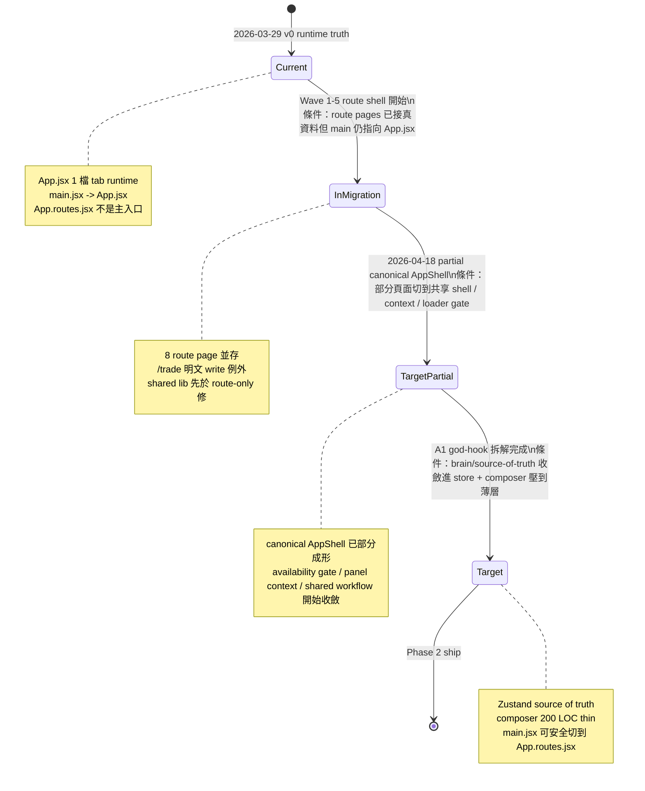

# AI 協作指南

> 📌 此檔為次讀文件 · 請先讀根目錄 `README.md`

最後更新：2026-04-18
狀態：唯一 canonical AI 規則文件

---

> **TL;DR — 接手前先確認這三件事**
>
> 1. 執行入口是 `src/main.jsx → src/App.jsx`（經由 `useAppRuntime.js` + `AppShellFrame.jsx`），不是 `App.routes.jsx`
> 2. 啟動用 `vercel dev --listen 0.0.0.0:3002`；Mac mini 本機看 `http://127.0.0.1:3002`，遠端 MacBook 經 Tailscale 看 `http://mac-mini.taila0e378.ts.net:3002`
> 3. 改完跑 `npm run verify:local`；宣稱「已完整驗證」前必須貼完整輸出

---

## 1. 先讀順序

所有 AI 與人類接手者，先讀：

1. `README.md`
2. `docs/AI_COLLABORATION_GUIDE.md`
3. `docs/CANONICAL-INDEX.md`
4. `docs/status/current-work.md`（只有在接手進行中的工作時）

狀態同步規則：

- `docs/status/current-work.md` 是唯一 canonical 任務 checkpoint 真相
- `docs/status/ai-activity.json` 是 canonical AI 即時工作狀態真相
- `docs/status/ai-activity-log.json` 是 canonical AI 即時活動 feed 真相
- `docs-site/state.json` 只是 docs-site 的衍生展示檔，不是獨立黑板
- docs-site 前端在手動「立即刷新」時，會直接讀 `docs-site/current-work.md`、`docs-site/ai-activity.json`、`docs-site/ai-activity-log.json` 的 canonical 鏡像，不再只依賴 `state.json`
- 每次完成可交接的小 checkpoint，必須寫回 `docs/status/current-work.md`
- 每次 AI 開始 / 進度推進 / 完成 / 交接工作時，可用 `scripts/ai-status.sh` 或 `scripts/ai-state.sh` 更新 `ai-activity`、`ai-activity-log` 與 checkpoint
- `scripts/launch-qwen.sh`、`scripts/launch-gemini.sh`、`scripts/launch-gemini-research-scout.sh` 現在會在啟動時自動登記 `working` 狀態；若要更新更細的作業過程，請再補 `progress`
- docs-site 啟動腳本會同時啟動 `refresh-ai-presence.py` daemon，從 `~/.qwen`、`~/.gemini`、`~/.claude`、`~/.codex` 活動痕跡自動回填 `ai-activity`；即使其他 AI 沒手動回報，也能在儀表板看到近期作業狀態
- 本 repo 的變更歸因標準組合是：`GitLens + BlamePrompt + ai-status/launcher`
- 若需要讓 docs-site 同步新進度，再執行 `bash scripts/sync-state.sh`
- 只有在需要重刷 build / lint / tests 健康狀態時，才執行 `bash scripts/sync-state.sh --full`

---

## 2. 這個程式在做什麼

這是一個台股投資決策工作台，不是單純看盤頁或聊天介面。

它把以下工作串成閉環：

- 持倉管理
- 觀察股管理
- 催化事件追蹤
- 收盤分析
- 深度研究
- 復盤與策略記憶沉澱

更完整說明看：

- `docs/CANONICAL-INDEX.md`
- `docs/specs/2026-04-18-portfolio-dashboard-sa.md`

### 台股分析底線

台股分析不能只看持倉本身，至少要同時理解：

- **市場結構**：漲跌停、量價結構、融資融券、權證時間價值、ETF / 槓桿產品特性
- **時間節奏**：月營收、財報、法說、除權息、政策題材、事件窗口
- **資金行為**：外資 / 投信 / 自營商、主流族群輪動、題材資金擁擠度
- **產業與供應鏈**：龍頭 / 二線、上游下游、報價循環、景氣位置
- **資料新鮮度**：過期財報、舊目標價、舊事件不可以當成當下結論

策略大腦的任務不是「替持倉寫心得」，而是把台股市場運作方式一起納入判斷。

---

## 3. 先分清楚：現在真相與目標藍圖

這份 repo 目前同時存在兩條線：

- 穩定主 runtime：`src/main.jsx -> src/App.jsx`
- route migration line：`src/App.routes.jsx` + `src/pages/*` + `src/hooks/useRoute*`

這兩條線不能被當成同等權威。

### 3.1 狀態機總覽（State Machine）



- `Current`：今天就成立的 runtime 真相。日期基準 `2026-03-29`。
- `InMigration`：route shell 開始接真資料，但仍不得宣稱已完成主入口切換。日期區間 `2026-03-29 ~ 2026-04-18`。
- `TargetPartial`：截至 `2026-04-18` 已有部分 canonical AppShell 收斂，但 brain/source-of-truth 仍未完全進 store。
- `Target`：A1 god-hook 拆解完成後才成立；屆時 route layout、store、async model 才算真正收斂。

### 3.2 現在真相（Current Truth）

以下內容是今天就成立、接手時必須遵守的規則。

#### Runtime 入口

- 目前真正執行入口是 `src/main.jsx -> src/App.jsx`
- `src/main.jsx` 目前只負責 boot runtime diagnostics 與 render `App`
- 不要假設 repo 已完全切到 route shell 版本
- 若發現 `src/main.jsx` 被改去 render `App.routes.jsx`，先視為未完成遷移，優先收回穩定 runtime，再逐段搬移

#### Route shell 的真實定位

- `src/App.routes.jsx` 與 `src/pages/*` 不是純假資料 scaffold
- 它們已經有部分真實資料接線與真實 workflow
- 但它們仍不是主 runtime，也不是目前唯一 source of truth
- route migration line 的任務是逐段收斂與替代，不是和 `src/App.jsx` 長期雙軌並行長大

#### 當前狀態權威

- 今天的共享狀態權威，仍以 `src/App.jsx` 與其 orchestration hooks 為主
- Zustand stores 已存在，但目前不是預設 source of truth
- TanStack Query 已存在於 route shell 與部分 API hooks，但目前不是全域資料權威
- 若任務是修今天真正在跑的行為，先修 shared lib / shared hook / `src/App.jsx` 主 runtime，不要只修 route-only 分支

#### `App.jsx` 的當前責任

- `src/App.jsx` 現在是很薄的 runtime entry wrapper，不是 route shell
- `src/App.jsx` 目前主要只負責呼叫 `src/hooks/useAppRuntime.js` 並 render `src/components/AppShellFrame.jsx`
- `src/App.jsx` 必須維持 React Fast Refresh 相容的 export 形狀：只保留 default export `App`
- 不要再把 constants / helpers / storage utils 從 `src/App.jsx` 重新 export
- 真正的主 runtime 狀態與 workflow wiring 現在以 `src/hooks/useAppRuntime.js` 為主
- render 外殼、Header boundary、AppPanels provider 與 confirm dialog render 現在以 `src/components/AppShellFrame.jsx` 為主
- 若需要共用邏輯，移到 `src/lib/*`、`src/hooks/*` 或 `src/constants.js`
- `AppPanels` 現在優先透過 `src/contexts/PortfolioPanelsContext.jsx` 取用 panel data / actions；不要再把 `overviewProps / holdingsProps / dailyProps / ...` 這類大包 props 重新塞回 `src/App.jsx -> src/components/AppPanels.jsx`
- `PortfolioPanelsContext` 是 panel-scope 去耦邊界，不是新的全域狀態權威；不要把它誤用成 store 替代品

#### 當前主要 runtime 邊界

- Portfolio lifecycle：
  `src/hooks/usePortfolioManagement.js`
  `src/hooks/usePortfolioDerivedData.js`
  `src/hooks/usePortfolioBootstrap.js`
  `src/hooks/usePortfolioPersistence.js`
  `src/hooks/usePortfolioSnapshotRuntime.js`
- Dossier / report / backup / lifecycle：
  `src/hooks/usePortfolioDossierActions.js`
  `src/hooks/useReportRefreshWorkflow.js`
  `src/hooks/useLocalBackupWorkflow.js`
  `src/hooks/useEventLifecycleSync.js`
- App shell / transient UI：
  `src/hooks/useAppConfirmationDialog.js`
  `src/hooks/useWeeklyReportClipboard.js`
  `src/hooks/useWatchlistActions.js`
  `src/hooks/useTransientUiActions.js`
  `src/hooks/useSavedToast.js`
  `src/hooks/useAppRuntime.js`
  `src/hooks/useAppShellUiState.js`
  `src/hooks/useCanonicalLocalhostRedirect.js`
  `src/hooks/useAppRuntimeComposer.js`
  `src/hooks/usePortfolioPanelsContextComposer.js`
  `src/hooks/useAppRuntimeSyncRefs.js`
  `src/hooks/useAppCallbackRefs.js`
- Analysis / research：
  `src/hooks/useDailyAnalysisWorkflow.js`
  `src/hooks/useResearchWorkflow.js`
  `src/hooks/useStressTestWorkflow.js`
  `src/hooks/useEventReviewWorkflow.js`
- App shell render：
  `src/components/AppShellFrame.jsx`
  `src/components/AppPanels.jsx`
  `src/contexts/PortfolioPanelsContext.jsx`
  `src/lib/appShellRuntime.js`
- Canonical utility modules：
  `src/lib/brainRuntime.js`
  `src/lib/dailyAnalysisRuntime.js`
  `src/lib/researchRuntime.js`
  `src/lib/reportRefreshRuntime.js`
  `src/lib/dossierUtils.js`
  `src/lib/reportUtils.js`
  `src/lib/eventUtils.js`
  `src/lib/datetime.js`
  `src/lib/market.js`
  `src/lib/portfolioUtils.js`
  `src/lib/tradeParseUtils.js`

#### Route migration line 的當前邊界

- `src/App.routes.jsx` 是未來主入口的 route shell，不是今天的主入口
- route shell 第一批真實資料接線在：
  `src/lib/routeRuntime.js`
  `src/pages/usePortfolioRouteContext.js`
- route shell 第二批頁面接線在：
  `src/hooks/useRoute*Page.js`
  `src/hooks/useRoutePortfolioRuntime.js`
- `src/App.routes.jsx` 已自帶 route-local `QueryClientProvider`
- route shell 若要套用正式 strategy brain，必須走 `src/hooks/useRoutePortfolioRuntime.js` 提供的 `setStrategyBrain()`
- `api/research.js` 的 `evolve / portfolio` 研究結果現在以 `brainProposal` 候選提案回傳，不再直接自動覆蓋正式 strategy brain

#### 共享互動邊界

- `src/components/Header.jsx` 現在支援 `portfolioEditor` 與 `portfolioDeleteDialog` props
- `src/components/common/Dialogs.jsx` 是目前 runtime 的 shared dialog 邊界
- 不要再引入 `window.prompt()` / `window.confirm()` / `window.alert()`
- 截至 2026-03-29，`rg -n "prompt\\(|confirm\\(|alert\\(" src` 應為 0；若再出現，視為 regression
- `ErrorBoundary` 目前採 panel-scoped 策略：在 `src/App.jsx` 針對 `Header` 與各主要 panel 包 boundary，而不是在 `src/main.jsx` 外層包整個 App
- `saved` 提示訊息現在應優先走 shared `notifySaved / flashSaved` 管線；不要再在新 workflow 內手刻 `setSaved(...) + setTimeout(...)`

#### 特定功能的 canonical 入口

- 收盤分析流程：`src/hooks/useDailyAnalysisWorkflow.js`
- 深度研究流程：`src/hooks/useResearchWorkflow.js`
- 壓力測試流程：`src/hooks/useStressTestWorkflow.js`
- 事件復盤流程：`src/hooks/useEventReviewWorkflow.js`
- 交易截圖 / OCR / 補登日期 / 多圖佇列：`src/hooks/useTradeCaptureRuntime.js`
- OCR 正規化 / batch 寫入 / 批次摘要 / 低信心檢查：`src/lib/tradeParseUtils.js`
- Dossier 組裝 /台股 hard gate / prompt context：`src/lib/dossierUtils.js`
- Analysis history / analyst report normalize：`src/lib/reportUtils.js`
- 日期 / market clock / storage-date formatting：`src/lib/datetime.js`
- Market cache / post-close sync gate / quote parsing：`src/lib/market.js`
- Portfolio registry / localStorage / backup import-export：`src/lib/portfolioUtils.js`
- 歷史交易修補 patch 套用：`src/lib/portfolioUtils.js`

#### 開發衛生規則

- 若文件與實際程式不一致，以 repo 內目前檔案為準
- 若要更新 AI 即時工作狀態，優先使用 `AI_NAME=<Name> ./scripts/ai-status.sh start|done|handover|suggest|blocker "..."`
- 若要更新「作業過程」，使用 `AI_NAME=<Name> ./scripts/ai-status.sh progress "..."`
- `scripts/ai-status.sh done|handover|suggest|blocker` 會自動寫回 `docs/status/current-work.md` 並同步 docs-site
- 若要讓 Git 歸因穩定可讀，優先透過 `scripts/launch-qwen.sh`、`scripts/launch-gemini.sh`、`scripts/launch-gemini-research-scout.sh` 啟動 AI；這些 launcher 會自動帶入 AI 專屬 `GIT_AUTHOR_*` / `GIT_COMMITTER_*`
- 若 AI 需要建立 commit，優先使用 `AI_NAME=<Name> bash scripts/ai-commit.sh "message"`；它會用 AI 專屬 author identity 寫 commit，並附上 `AI-Agent` / 狀態來源 metadata
- **每個 AI 必須在工作結束前 commit 自己的改動。** 不要留下 unstaged/uncommitted 的改動給下一個 AI。曾發生 Codex 的改動沒 commit，被混進 Claude 的 commit 裡，導致 git blame 歸因錯誤、rollback 困難。如果因故無法 commit（如 lint 不過），必須在 `docs/status/current-work.md` 記錄哪些檔案有 uncommitted changes
- **commit 前只 stage 自己改的檔案。** 不要用 `git add -A` 或 `git add .`，因為其他 AI 可能同時有 uncommitted 改動在工作目錄裡。用 `git add <specific-files>` 明確指定
- VS Code workspace 已推薦安裝 `eamodio.gitlens` 與 `blameprompt.blameprompt`
- 本機已安裝 BlamePrompt CLI；若要查看 AI receipts，可用 `blameprompt blame <file>`、`blameprompt diff`、`blameprompt show <commit>`
- 歷史快照 / backup 檔不可再放在 `src/` 活躍 source tree；請改放 `.archive/` 或 repo 外部備份
- JS/JSX workspace 專案邊界由 `jsconfig.json` 管理；新增檔案時請維持 include / exclude 收斂，不要把 `docs/`、`.tmp/`、`dist/`、`.archive/` 重新拉回活躍 JS project
- `src/App.jsx` 與其他 runtime hook 不應在 render 期直接讀寫 `ref.current`
- 若任務是主 runtime 的狀態 / workflow wiring，先看 `src/hooks/useAppRuntime.js`
- 若任務是 `useAppRuntime.js` 裡剩餘的 boot/runtime wiring 參數組裝，先看 `src/hooks/useAppRuntimeComposer.js`，不要再把大型 hook args object 直接堆回 `App.jsx`
- 若任務是 `AppPanels` 與各 panel 間的資料 / 行為傳遞，先看 `src/hooks/usePortfolioPanelsContextComposer.js` 與 `src/contexts/PortfolioPanelsContext.jsx`
- 若任務是 `App.jsx` 內晚期 callback ref 同步，例如 `refreshAnalystReportsRef` / `resetTradeCaptureRef`，先看 `src/hooks/useAppCallbackRefs.js`
- 若看到 `src/lib/market.js` 或 `src/lib/portfolioUtils.js` 出現 placeholder / stub 版本，視為不完整 refactor，應優先修回 canonical helper 實作

### 3.2 持股分析模型

這是 AI prompt 的輸入資料源，修分析邏輯前必須理解。

#### STOCK_META（定義在 `src/seedData.js`，引用於 10+ 個模組）

每檔持股有五個欄位：

| 欄位       | 說明     | 範例值                                   |
| ---------- | -------- | ---------------------------------------- |
| `industry` | 產業分類 | `AI/伺服器`、`光通訊`、`半導體`          |
| `strategy` | 策略框架 | `成長股`、`景氣循環`、`事件驅動`、`權證` |
| `period`   | 持有週期 | `短`、`短中`、`中`、`中長`               |
| `position` | 持倉定位 | `核心`、`衛星`、`戰術`                   |
| `leader`   | 產業地位 | `龍頭`、`小龍頭`、`二線`、`小型`         |

`IND_COLOR`（同在 `src/seedData.js`）：每個產業對應一個 Tailwind 400 色，供 UI 標示用。

#### 使用規則

- `STOCK_META` 已傳入 AI 分析 prompt（via `dossierUtils.js` → `knowledgeBase.js`），不要在 prompt 內重複硬寫分類
- **不能用同一套邏輯判斷全部個股**，必須依 `strategy` 欄位分流分析
- 新增持股時，**必須同步更新 `STOCK_META`**，否則 dossier、持倉健檢、知識庫注入都會遺漏該股分類
- `themes` 欄位（外部資源整合 Phase A 後新增）：標記該股所屬主題（如 `AI伺服器`、`CoWoS`）

#### 主要引用位置

- `src/lib/dossierUtils.js` — dossier 組裝與 prompt context（含 knowledgeBase 注入）
- `src/lib/researchRuntime.js` — 深度研究 context
- `src/hooks/usePortfolioDerivedData.js` — 投組健檢與產業集中度計算
- `src/components/holdings/HoldingsPanel.jsx` — 持倉顯示
- `src/lib/knowledgeBase.js` — 依 `strategy` 類型選取相關知識庫條目注入 prompt

---

### 3.3 狀態機解讀

- `Current -> InMigration`：觸發條件是 route shell 開始承接真資料，但 `main.jsx` 仍以 `App.jsx` 為主入口。
- `InMigration -> TargetPartial`：觸發條件是共享 shell、panel context、availability gate、shared workflow 開始變成 canonical，而不是 route-only 試驗品。
- `TargetPartial -> Target`：觸發條件是 A1 god-hook 拆解完成，brain-related state 收斂到明確 store，`useAppRuntimeComposer` / route composer 只剩薄層組裝。
- 在到達 `Target` 前，不能假設 `App.routes.jsx` 已是主入口，也不能假設 Zustand / TanStack Query 已全面接手。
- 遷移順序不變：先修文件真相，再守 shared module，之後才收共享狀態、server-state，最後才切入口。

---

## 4. 本地執行與固定網址

### 本地完整模式

唯一正確啟動方式：

```bash
vercel dev --listen 0.0.0.0:3002
```

不要用：

- `npm run dev`
- `vite`

因為那只會啟動前端，不會帶起 repo 內 API。

### 固定網址

- Mac mini 本機 canonical URL：`http://127.0.0.1:3002`
- 遠端 MacBook 經 Tailscale canonical URL：`http://mac-mini.taila0e378.ts.net:3002`

不要改用 `localhost:3002`，否則同一台機器上的 localStorage 會分裂。遠端 MacBook 雖然能連進來，但它是另一個瀏覽器 origin，不會自動共用 Mac mini 本機瀏覽器狀態。

---

## 5. 驗證規則

### 何時跑哪個命令

| 情境                               | 命令                                        | 最低要求          |
| ---------------------------------- | ------------------------------------------- | ----------------- |
| 日常開發完成                       | `npm run verify:local`                      | 全部通過          |
| 只改 UI / 樣式                     | `npm run lint && npm run build`             | build 無錯        |
| 改到 runtime / storage / AI 主流程 | `npm run verify:local` + `npm run smoke:ui` | 全部通過          |
| 部署或本地重啟後                   | `npm run smoke:ui`                          | HTTP 200 + 無白頁 |
| 宣稱「已完整驗證」                 | `npm run verify:local`                      | 必須貼完整輸出    |

### 各命令說明

```bash
npm run healthcheck          # 檢查 /index.html、Vite client、App.jsx HMR 狀態
npm run check:fast-refresh   # Fast Refresh 邊界檢查
npm run smoke:ui             # UI smoke（HTTP + 無白頁）
npm run verify:local         # 完整：fast-refresh + lint + typecheck + test + build + healthcheck + smoke
npm run lint
npm run build
```

注意：

- `HTTP 200` 不代表前端沒有白頁
- 只要有部署、本地重啟、或改到 runtime / storage / AI 主流程，就應跑 `npm run smoke:ui`
- `npm run healthcheck` 現在還會檢查 `/index.html`、`/@vite/client`、`/src/main.jsx` 與首頁連到的前端資源
- `npm run healthcheck` 也會讀 `.tmp/vercel-dev.log`，補看 Vite frontend 訊號與 HMR invalidation 警告
- 若 `healthcheck` 回報 `Latest App.jsx Vite event is healthy`，代表最近一次 `src/App.jsx` HMR 事件沒有再落入 invalidation
- 若要回報「已完整驗證」，不要只貼 `build` 或 `healthcheck`，至少要貼 `verify:local`

---

## 5.1 問題排查指南

### 白頁或無法啟動

1. 跑 `npm run healthcheck` 檢查基本健康狀態
2. 跑 `npm run verify:local` 完整驗證
3. 檢查 `.tmp/vercel-dev.log` 看 Vite frontend 訊號
4. 若你人在 Mac mini 本機，確認使用 `http://127.0.0.1:3002`；若你從遠端 MacBook 驗證，使用 `http://mac-mini.taila0e378.ts.net:3002`

### Fast Refresh 問題

1. 跑 `npm run check:fast-refresh`
2. 確認 `src/App.jsx` 只保留 default export `App`
3. 確認沒有在 render 期直接讀寫 `ref.current`
4. 確認 constants / helpers 已外移到 `src/lib/*` 或 `src/constants.js`

### 測試失敗

1. 跑 `npm run test:run` 看完整測試結果
2. 單一測試失敗：`npx vitest run tests/path/to/test.test.jsx`
3. 檢查是否有 flaky timeout（見 `tradePanel.dialogs.test.jsx` 範例）

### Lint / Typecheck 錯誤

1. `npm run lint` — ESLint 檢查
2. `npm run typecheck` — TypeScript 檢查（JS 專案也用得到）
3. 確認沒有使用 `window.prompt()` / `window.confirm()` / `window.alert()`

### 策略大腦 / AI 相關問題

1. 先看本章的 eval 規則與 `scripts/eval_brain.mjs`
2. 跑 `node scripts/eval_brain.mjs` 回放測試案例
3. 檢查資料新鮮度（`freshness-gating`）
4. 確認逐檔 outcome（`per_stock_resolution`）

### 協作與分工問題

1. 查看本章 §8「AI 分工與任務路由」
2. 查看本章 §9「交接格式」
3. 不確定該誰做？→ 查看 §8「任務類型分配」表格

### Runtime 錯誤

1. 檢查 `sessionStorage["pf-runtime-diagnostics-v1"]`
2. 查看 panel-scoped ErrorBoundary 是否觸發
3. 確認沒有未處理的 Promise 拒絕

### Strategy Brain Eval Program

本專案使用「台股策略邏輯回放評測器」來驗證策略大腦的優化，而非靠感覺改 prompt。

**每輪標準流程**：

1. 選 1 個 capability（`freshness-gating` / `event-review-per-stock` / `analog-explainability`）
2. 跑 `node scripts/eval_brain.mjs`
3. 讀結果：總分、每個 case 的 pass/fail、哪個維度失敗
4. 只修高信號失敗案例
5. 重跑
6. 分數進步才保留；若 critical gate 退步就回滾

**評分重點**：

- `gate_correctness` — stale / missing 的月營收、法說、財報、目標價/報告，不可被當成 `validated`
- `per_stock_resolution` — 多股票事件必須逐檔留下 outcome
- `analog_explainability` — casebook 必須能說清楚相似維度與差異維度
- `unsupported_claim_penalty` — 沒資料卻硬判 fresh / validated 直接失敗

**接受門檻**：

- Critical cases 全過
- 總分 `>= 85`
- 不可出現 unsupported claim
- 已通過 case 不可退步

**多模型分工**：

- `Gemini` — 用戶盲點審查 / multi-LLM 反駁，不直接當資料蒐集 lane
- `Qwen` — 低風險 patch / test / helper
- `Codex` — 最終裁決、修改策略邏輯、驗收分數、決定保留或回滾

**本輪固定案例集**：

- `evals/cases/daily-analysis/freshness-gating-001.json`
- `evals/cases/event-review/per-stock-review-001.json`
- `evals/cases/brain-validation/analog-dimensions-001.json`

---

## 6. Runtime diagnostics

- 前端全域錯誤、未處理 Promise 拒絕、以及 React error boundary 錯誤，現在都會統一寫到 `sessionStorage["pf-runtime-diagnostics-v1"]`
- `web-vitals` 也已接到同一個 adapter，會以 `kind: "web-vital"` 寫進同一份 diagnostics
- remote sink 現在支援兩條：
  - analytics HTTP sink：預設可對 `/api/telemetry` 批次上報
  - Sentry bridge sink：若頁面上存在 `window.Sentry`，可把 diagnostics 橋接進 Sentry
- 啟用方式：
  - 在 app boot 前設定 `window.__PORTFOLIO_RUNTIME_MONITORING__`
  - 或透過 `VITE_RUNTIME_ANALYTICS_ENABLED`、`VITE_RUNTIME_ANALYTICS_ENDPOINT`、`VITE_RUNTIME_SENTRY_ENABLED`
- 若要接第三方監控（如 Sentry / LogRocket），優先沿用 `src/lib/runtimeLogger.js`，不要再到處直接散寫 `console.error`

---

## 7. 知識庫分工

### 知識庫現況（2026-03-31）

**知識庫已完成 600/600 條目標，品質測試 25/25 全過。**

| 指標          | 數值                         |
| ------------- | ---------------------------- |
| 總條目        | 600（7 分類各達 target）     |
| action 量化率 | 98.7%（測試門檻 5%）         |
| 簡體中文      | 0 violation                  |
| 策略覆蓋      | 11 種（含 STOCK_META alias） |
| 版本          | `index.json` v2.0.0          |

### 知識庫團隊與已完成工作

| 角色       | 職責                    | 已完成工作（2026-03-31）                                                                                                                                       |
| ---------- | ----------------------- | -------------------------------------------------------------------------------------------------------------------------------------------------------------- |
| **Qwen**   | 知識庫搭建工程師        | 基礎架構搭建（schema/JSON/API）、初版 348 條匯入、quality-validation.json 框架                                                                                 |
| **Claude** | 知識庫架構師 / 品質審查 | 品質審查+4 bug fix、補齊 202 條至 600、action 量化改寫 130 條、knowledgeBase.js 策略映射擴充+alias 修正、測試從 13→25 個+門檻收緊、autoresearch-style 實驗帳本 |
| **Codex**  | 策略大腦 / 研究流程     | **待接手**：把 `api/research.js` 改成 candidate brain proposal 模式（見下方「下一步」）                                                                        |

### 已安裝的開發工具

| 工具                   | 來源                             | 安裝方式                       | 用途                                                                        |
| ---------------------- | -------------------------------- | ------------------------------ | --------------------------------------------------------------------------- |
| **superpowers** v5.0.6 | `obra/superpowers`               | `claude plugin install`        | brainstorming、subagent-driven-dev、systematic-debugging、TDD、verification |
| **notebooklm-skill**   | `PleasePrompto/notebooklm-skill` | `~/.claude/skills/notebooklm/` | 外部文件知識查詢（需 Google 帳號認證）                                      |

### 知識庫 ↔ 應用串接路徑

```
STOCK_META (seedData.js)
  ↓ strategy 欄位（如 '成長股', 'ETF/指數', '價值股', '轉型股'）
knowledgeBase.js — STRATEGY_KNOWLEDGE_MAP + UNIVERSAL_SOURCES
  ↓ getRelevantKnowledge() + getRelevantCases()
dossierUtils.js — buildKnowledgeContext(dossier.stockMeta)
  ↓ 注入 prompt
api/analyze.js — daily analysis 使用知識庫 context
api/research.js — deep research 使用知識庫 context
```

**重要：** STOCK_META 的 strategy 名稱已與 STRATEGY_KNOWLEDGE_MAP 對齊（含 alias），`ETF/指數`↔`ETF指數`、`價值股`↔`價值投資`、`轉型股`↔`轉機股` 都能命中。新增持股時須確認 strategy 值在 map 中有對應。

### 知識庫品質保障

- 測試：`tests/lib/knowledge-base.test.js`（25 個測試）
- 實驗帳本：`docs/superpowers/kb-experiment-results.tsv`（autoresearch-style）
- 門檻：action 量化率>95%、簡體字 0、ID 唯一、confidence 0-1、metadata 一致

### 下一步（Codex 接手）

Codex 提出的 autoresearch 借鑒方向，按優先序：

1. **`api/research.js` 改成 candidate brain proposal**（不直接覆蓋正式 brain）
   - 產出：`proposed_rules`, `rules_to_stale`, `evidence_refs`, `expected_gain`, `risk_notes`
   - 經過 gate / eval 才 merge 進正式 brain
2. **research run ledger**（研究實驗帳本）
   - 固定欄位：run_id, mode, prompt_version, input_snapshot, output_summary, score, keep/discard, reason
3. **eval loop 接到 research 主流程**
   - 歷史 eval program 文件已歸檔；目前 gate 應直接接到可執行腳本與固定案例
   - research 產生候選 brain → 自動跑固定 cases → 未過 gate 不落盤
4. **固定預算與停止條件**
   - 每次 evolve 最多 1-3 輪，沒有分數進步就停止

Claude 在 Codex 完成後負責：驗證 proposal schema 正確性、gate 邏輯 edge case、prompt 契約品質。

### 協作流程

```
Qwen（搭建）→ Claude（審查+補齊+品質）→ Codex（策略大腦演化流程）→ Claude（最終驗證）
```

### 事件行事曆自動化架構（2026-04-01）

事件蒐集已從「手動/AI 蒐集」遷移到「Vercel Cron 自動蒐集」，設計支援多用戶。

**架構圖：**

```
┌─ Vercel Cron（週一~五 UTC 00:00 = 台灣 08:00 盤前）──────┐
│                                                           │
│  api/cron/collect-daily-events.js                         │
│  ├── MOPS 重大訊息（今天 + 未來 3 天，HTML parsing）        │
│  ├── 固定行事曆（月營收日/FOMC/央行/財報季/除權息）          │
│  └── 寫入 Vercel Blob: daily-events/YYYY-MM-DD.json       │
│                                                           │
└───────────────────────────────────────────────────────────┘
                           │
                    Vercel Blob（共用）
                           │
        ┌──────────────────┼──────────────────┐
        │                  │                  │
   用戶 A 瀏覽器      用戶 B 瀏覽器      用戶 C ...
   useAutoEvent       useAutoEvent
   Calendar.js        Calendar.js
   ├── 讀 Blob 快照    ├── 讀 Blob 快照
   ├── 用自己持股篩選   ├── 用自己持股篩選
   └── 合併 newsEvents └── 合併 newsEvents
```

**事件來源與 AI 依賴：**

| 來源            | 技術         | 需要 AI           | 頻率         |
| --------------- | ------------ | ----------------- | ------------ |
| MOPS 重大訊息   | HTML parsing | 不需要            | Cron 每日    |
| 固定行事曆      | 硬編碼規則   | 不需要            | Cron 每日    |
| Google News RSS | RSS parsing  | 抽取時需要 Claude | 用戶手動觸發 |
| Gemini 蒐集     | 搜尋+判斷    | 需要 Gemini       | 不定期       |

**多用戶原理：** Cron 蒐集的是全市場公共事件（不綁定任何人持股），篩選在前端用 `codesSet.has(code)` 按用戶持股過濾。公共事件（FOMC、央行）所有人都看到。

**關鍵檔案：**

| 檔案                                | 職責                                  |
| ----------------------------------- | ------------------------------------- |
| `api/cron/collect-daily-events.js`  | Cron handler，蒐集 MOPS + 固定行事曆  |
| `api/event-calendar.js`             | 即時 API（Blob 讀不到時的 fallback）  |
| `api/mops-announcements.js`         | MOPS 重大訊息 parser                  |
| `src/hooks/useAutoEventCalendar.js` | 前端 hook，讀 Blob → 篩選 → 合併      |
| `vercel.json` crons                 | Cron 排程定義                         |
| `docs/gemini-research/`             | Gemini 手動蒐集的結構化輸出（補充用） |

**部署要求：** Vercel Dashboard 需設環境變數 `CRON_SECRET`（任意字串），Cron 才能驗證身分。

### JSON 知識層

本應用程式的結構化知識（持倉、觀察股、催化事件、分析歷史）由以下管理：

- `src/lib/portfolioUtils.js` - Portfolio registry / localStorage / backup import-export
- `src/lib/dossierUtils.js` - Dossier 組裝 / 台股 hard gate / prompt context
- `src/lib/reportUtils.js` - Analysis history / analyst report normalize
- `src/lib/market.js` - Market cache / post-close sync gate / quote parsing
- `src/lib/knowledge-base/` - 股票分析知識庫（7 分類、600 條、v2.0.0）
- `src/lib/knowledgeBase.js` - 知識庫檢索+策略映射+prompt 注入

### 知識條目格式

每條知識包含「事實 / 解讀 / 動作」三層結構，action 必須含量化門檻：

```json
{
  "id": "ta-001",
  "title": "早晨之星買進訊號",
  "fact": "下跌趨勢中出現長黑 + 跳空小 K+ 長白三根 K 棒",
  "interpretation": "空方力道耗盡，多方反轉訊號",
  "action": "第三根 K 棒收盤確認後買進，停損設在早晨之星低點",
  "confidence": 0.7,
  "tags": ["K 線", "反轉", "買進訊號"],
  "source": "K 線型態實務"
}
```

### 資料優先序（Claude 建議）

分析時應遵循以下資料優先序：

1. **TWSE 官方資料** (twsemcp) — 最權威
2. **FinMind** — 深度研究
3. **twstock** — 本地 fallback
4. **TradingView** — 技術面補強
5. **模型推論** — 最後才用

**原則：**

- 不同來源數字不一致時，採用較新的官方資料
- 不能把技術面判斷寫成基本面事實
- 沒有資料就明說缺資料，不要假裝知道

### 分析產出結構（Claude 建議）

所有分析產出應分為三層：

1. **事實（Fact）** — 數據、收盤價、成交量、法人買賣超
2. **解讀（Interpretation）** — 量價背離、題材延續、財報預期變化
3. **動作建議（Action）** — 續抱 / 減碼 / 停損觀察點

### 收盤分析模板（Claude 建議）

**應該做：**

- ✅ 短、準、可行動
- ✅ 只列最重要的 1-3 檔異常持股
- ✅ 每檔都要有「事實 + 解讀 + 動作」

**不該做：**

- ❌ 把所有持股都重寫成長報告
- ❌ 為了完整而塞太多產業背景
- ❌ 在沒有新資料時重複昨天的結論

### 深度研究模板（Claude 建議）

**單股研究應回答：**

- 核心邏輯是否還成立
- 未來 1-3 個月催化劑與時間點
- 最可能的 3 個風險
- 估值偏高/偏低，和誰比
- 操作計畫（進場區、加減碼、停損）

**全組合研究應回答：**

- 哪些部位最需要立即動作
- 資金配置是否失衡
- 哪些策略規則已過時
- 哪些錯誤在反覆發生

### API 端點

- `GET /api/knowledge?action=search&q=台積電` — 搜尋知識
- `GET /api/knowledge?action=similar&stockId=2330` — 獲取相似案例
- `GET /api/knowledge?action=stats` — 分類統計
- `POST /api/knowledge` — 添加知識項目

### 誰負責什麼

| 知識類型          | 負責層                    | 說明                             |
| ----------------- | ------------------------- | -------------------------------- |
| 文件 / PDF / 報告 | Qwen                      | 文件讀取、比較、摘要整理         |
| 結構化投資知識    | JSON 知識層               | 持倉、事件、分析、報告的持久化   |
| 股票分析知識庫    | `src/lib/knowledge-base/` | 產業趨勢、消息連動、籌碼技術分析 |
| 最新公開資訊      | Gemini CLI                | 新聞、公告、法說、外部研究       |
| 策略規則判定      | Codex/Claude              | 最終 truth、schema、客戶數字     |

---

## 8. AI 分工與任務路由

### AI 分工總表

| AI         | 適合的工作                                                                 | 不適合 / 需最終審查                       | 常見困難                                                       | 目前穩定用法                                                        |
| ---------- | -------------------------------------------------------------------------- | ----------------------------------------- | -------------------------------------------------------------- | ------------------------------------------------------------------- |
| **Codex**  | 高風險邏輯、strategy brain 最終判定、schema / persistence / cloud sync     |                                           | 資料層與 prompt 層不同步時，模型輸出可讀但不可安全回寫         | 技術主導、最終 reviewer、多模型協作裁決者                           |
| **Claude** | strategy brain second opinion、prompt 契約、雲端同步風險、client-facing    | 客戶版數字與結論的最終裁決                | 使用者期待高於目前資料品質時，容易被誤解成 prompt 問題         | 高風險邏輯 second opinion、validation                               |
| **Qwen**   | bounded implementation、機械式重構、lint / test、小型 UI cleanup、文件整理 | strategy brain、cloud sync、最終數字      | 如果任務邊界不清楚，容易碰到高風險區                           | plain Qwen CLI，低頻、明確、bounded 任務                            |
| **Gemini** | 最新資料搜尋、citation 蒐集、freshness 比對、新聞 / 公告 / 法說掃描        | fundamentals truth、target price 最終判定 | 容易把搜尋整合結果當成最終事實；某些高階模型會先碰到每日 quota | general: `gemini-2.5-flash`；scout: `gemini-3.1-flash-lite-preview` |

### 任務類型分配

#### 類型 1：高風險核心邏輯

例：策略大腦、validation lifecycle、truth-layer、cloud sync、損益正確性

分工：

- **Codex 主導**
- Qwen 不直接改主邏輯
- Gemini 只補外部資料，不做最後裁決

#### 類型 2：外部資料蒐集

例：法說 / 公告 / 新聞、公開目標價報導、公開 research 索引

分工：

- **Gemini 主導**
- Qwen 做文件檢索補充
- Codex 最後決定是否採用

#### 類型 3：低風險實作

例：UI 小改、helper 重構、測試、機械式整理

分工：

- **Qwen 主導**
- Codex review

#### 類型 4：文件與知識整理

例：spec 摘要、客戶報告素材整理、PDF / 會議 memo

分工：

- **Qwen 主導整理**
- Codex 審核可否進主流程

### 任務路由規則

以下工作預設由 **Codex** 或 **Claude** 主導：

- strategy brain 規則 lifecycle
- persistence / migration / import-export
- cloud sync
- 客戶版數字與結論
- 高風險 prompt 契約

以下工作適合交給 **Qwen**：

- 小型 patch
- 測試補齊
- UI cleanup
- 明確邊界的 helper 重構
- 文件整理與摘要

以下工作適合交給 **Gemini**：

- 最新資料搜尋
- citation 蒐集
- freshness 比對

若任務需要「最新」或「精準出處」，Gemini 只負責收集，最後仍要由主線實作者決定是否採納。

### 實用工作流程

#### 流程 A：文件先消化，再改程式

1. 由 Qwen 消化研究 PDF、財報摘要、客戶筆記，產出「內部研究摘要」
2. 再讓 Gemini CLI 補近期公開事實、來源與 freshness
3. 由 Codex 決定哪些要進策略大腦資料模型
4. 由 Qwen 做低風險實作
5. 最後回到 Codex 做驗收與修正

#### 流程 B：收盤分析品質優化

1. Qwen 整理近期文件與研究材料
2. Gemini CLI 補近期外部事件、法說 / 新聞 / 公告來源
3. Codex 根據 dossier + brain + 事件資料決定真正要改的 prompt 與規則更新流程
4. Qwen 負責把 UI / helper / 低風險串接補上
5. Codex 做最後檢查，確保不會再次出現「持倉很完整，但分析像割裂」

#### 流程 C：單一股票深度研究

1. Qwen 先做文件檢索與比較
2. Gemini CLI 先補公開來源、近期法說 / 新聞 / 報導
3. Codex 審核是否足夠回寫到 `fundamentals` / `targets` / `analystReports` / `strategyBrain`
4. Qwen 再做必要的 UI / 資料接線

### Checkpoint Meeting 規則

每次準備對使用者做階段性回報前，先做一次 checkpoint meeting。

至少檢查：

1. 哪些部分還不穩
2. 哪些資料來源仍不足
3. 哪些工作應該換 AI 接手
4. 是否需要新增 skill / 工具
5. 是否需要外部資料驗證

結論要寫回 `docs/status/current-work.md`

---

## 9. 交接格式

### 基本格式（所有任務）

所有 AI 交接時，至少用這四項：

- `done` — 完成了什麼
- `changed files` — 改了哪些檔案
- `risks` — 潛在風險與注意事項
- `next_best_step` — 下一步最佳行動

### 研究型任務額外格式

若任務涉及外部資料蒐集或研究，額外補充：

- `citations` — 來源連結
- `freshness` — 資料新鮮度（日期 / 時間）
- `unresolved_questions` — 尚未解決的問題

### 通用回報格式（建議）

更完整的回報可包含：

- `unknowns` — 不確定的地方
- `needs_external_ref` — 需要外部參考的事項

### Stop-in-5-Min 規則

若使用者表示「中斷」或任務需要暫停：

1. 所有 AI 在 5 分鐘內完成目前小段落
2. 不再開啟新 scope
3. 回寫以下三項：
   - 完成了什麼
   - 卡在哪裡
   - 下一步最小切點

---

## 10. 歷史文件處理方式

### 短版角色卡（留原位）

以下檔案現在都只是短版角色卡或歷史入口，不再各自維護完整規則：

- `claude.md`
- `docs/SERVER_ACCESS_GUIDE.md`
- `docs/testing/FUNCTIONAL_TEST_REPORT.md`

### 已刪除的歷史文件

以下文件已刪除，內容已併入本指南或已過時：

- 舊版 AI handbook → 已刪除，內容由本指南取代
- `docs/DOCUMENT_CLEANUP_PROPOSAL.md` → 已刪除，已被本次收斂取代
- `docs/specs/2026-03-25-qwen-anythingllm-setup-and-division.md` → 已刪除（AnythingLLM 已停用）
- `docs/specs/2026-03-26-anythingllm-tw-stock-prompt-templates.md` → 已刪除（AnythingLLM 已停用）
- `docs/plans/2026-03-25-strategy-brain-v2-llm-routing-plan.md` → 已刪除（內容已併入本指南 §2、§5、§8）
- `docs/status/ai-collaboration-channel.md` → 已刪除（內容已併入本指南）
- `docs/refactoring/*` → 已刪除（重構歷史記錄）
- `docs/DEBUG_REPORT_*.md` → 已刪除（已解決的 debug 報告）
- `docs/archive/*` → 已刪除（所有歸檔文件）

若任何舊文件提到：

- `App.routes.jsx` 才是主入口
- `App.jsx` 已只剩很小的 route shell
- 可以用 `npm run dev` 代表完整本地模式

都視為歷史資訊，不是目前真相。
