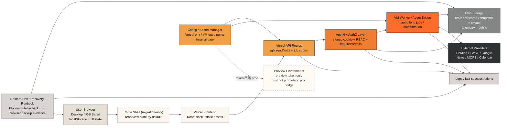
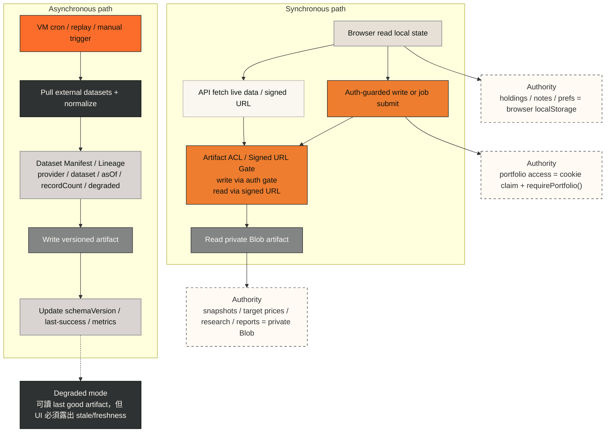
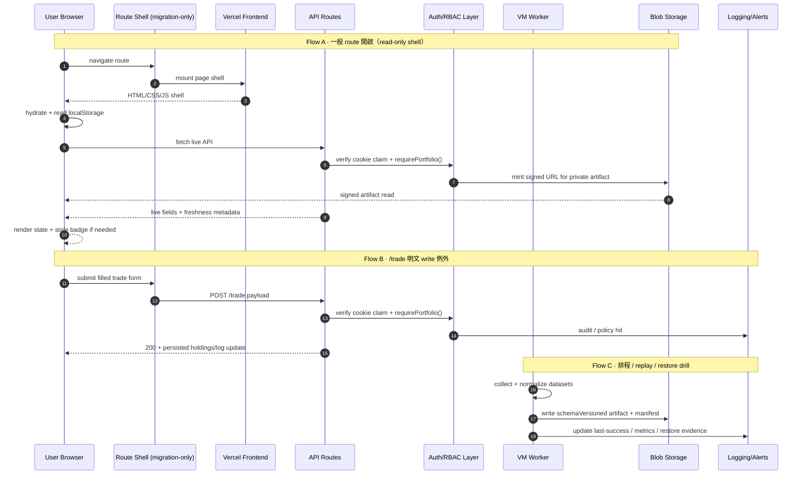

# 持倉看板架構圖

更新時間：`2026-04-18 14:02 CST`

## 1. 前言

這頁改為 **純架構閱讀版**。它只保留 internal beta 階段已收斂的 deployment truth、data authority、runtime / request boundary、RBAC、已決議 consensus 與產品語意 contract reference。

Task 2 的 `69` 條 active workstream、Phase 2 debt、9 層 DAG、T-ID 對應表已拆到 `todo.md` / `todo.html`，避免長表格把三視角架構圖與 auth boundary 淹掉。

本頁聚焦四件事：

1. 把 deployment、data flow、runtime / request 三個視角畫清楚。
2. 把 `§5 RBAC` 固定成 server-side authZ 真源。
3. 把 Q1-Q8 與 R108 共識寫死，避免已決議事項回頭重討。
4. 把 Morning Note、Today in Markets、Daily Principle、ThesisScorecard、X1-X5、Accuracy Gate、`analysisStage` 這些產品語意 contract 指向 canonical spec。

## 2. 三視角架構圖

### 2.1 Deployment View



**解讀**

1. Browser 仍是持倉、筆記、portfolio 偏好的 local-first 真源。
2. Blob 是 shared derived artifact 的真源，但 `brain / research / snapshot` 走 private + signed URL；telemetry 可保留 public。
3. `Config / Secret Manager` 是控制面，不再接受 `.env`、launch script export、preview/prod token 混用。
4. `Preview Environment` 必須和 prod bridge token 硬切開，不能只靠人腦約束。
5. `Restore Drill / Recovery Runbook` 被畫成 deployment box，表示它不是文件附錄，而是 production topology 的一部分。

### 2.2 Data Flow View



**解讀**

| 領域                                | authoritative source                | 不能含糊的原因                                           |
| ----------------------------------- | ----------------------------------- | -------------------------------------------------------- |
| 持倉、筆記、portfolio 偏好          | Browser localStorage                | multi-portfolio v1 已 ship，browser truth 不可假裝不存在 |
| snapshot、research、weekly artifact | private Blob + signed URL gate      | 共享衍生輸出需要 versioning、ACL、replay 與 restore      |
| target price / freshness / lineage  | backend metadata + manifest         | aggregate 可以接受，但來源、時間、degraded 不可藏        |
| portfolio authZ / insider branch    | cookie claim + `requirePortfolio()` | 不能靠 UI 判斷、prompt 文案或 path prefix                |
| degraded state                      | last good artifact + stale UI       | 可 degraded，但不能 silent degrade                       |

### 2.3 Runtime / Request View



**重點**

1. `Route Shell` 預設只做 `migration-only` read/view-state，不是 canonical runtime。
2. `/trade` 為明文 write 例外，屬 feature contract，不再誤標成 drift。
3. `analysisStage`、freshness、signed URL、audit log、restore evidence 都是 runtime truth；畫面只是消費者。
4. 排程不是「寫進 Blob 就算完成」，還要留下 last-success、lateness、restore evidence。

## 5. RBAC 模型

### 5.1 Claim

Cookie claim 形狀：

```json
{ "userId": "string", "role": "admin" }
```

或：

```json
{ "userId": "string", "role": "user" }
```

### 5.2 規則

1. 單一 admin：小奎，可看所有 portfolio。
2. 其他人預設 `role='user'`。
3. `role='user'` 必須通過 `portfolio.owner === userId`。
4. prefix / Blob path / localStorage key 都不能替代這個檢查。

### 5.3 Middleware 落點

在每個 `api/*` 入口拿到 `portfolioId` 後立刻執行：

```js
requirePortfolio(req, portfolioId)
```

## §6 已決議事項（避免重討）

- [News vs Events 拆](../decisions/2026-04-15-news-vs-events-separation.md)：已決，後續只談 polish，不回到單一卡片模型。
- [Knowledge API 留 Blob，不搬 VM](../decisions/2026-04-15-knowledge-api-blob-not-vm.md)：knowledge base 仍是 Blob 例外，不跟著大遷移。
- [HoldingDossier / freshness 歷史基礎](../decisions/2026-04-18-appshell-state-ownership.md)：schema 與 freshness 紀律已被併入 owner map 的歷史基礎段，不是 schema 不存在。
- [Multi-portfolio v1 已 ship](../archive/2026-Q2/spec-history/2026-03-23-multi-portfolio-event-tracking-design.md)：現在補的是 authZ 與 pid-scoped correctness，不是回頭辯論要不要支援多組合。
- [Streaming `/api/analyze?stream=1`](../archive/2026-Q2/spec-history/streaming-analysis-design.md)：已上線；本文只接它的 runtime contract 與 analysisStage 收口。
- [Targets freshness 7d/30d](../decisions/2026-03-25-targets-freshness.md)：backend 已算，缺的是 lineage / label / UI contract。
- [產品階段：stability-first](../decisions/2026-04-16-product-stage-stability-first.md)：prototype → internal beta；不開 multi-tenant / Stripe / public pricing。
- Q1：**product completion = internal beta 可交付 + 不 P0 爆炸**；public launch 深水區留給 beta+1。
- Q2：**Weekly export ship-before 只要求 clipboard / template / export narrative**；true PDF + cover render 延後。
- Q3：**restore 最小 lane = `T57 + T62 + slim T64` ship-before**；`T63` replay / manifest 工具延後。
- Q4：**insider policy 先做 server-side hardcoded code gate**；拒絕 prompt-only soft guard；configurable mode 留 beta+1。
- Q5：**Gemini grounding 只做 secondary summary**；hero 的 authoritative facts 仍以 FinMind / MOPS / 央行 / calendar 為主。
- Q6：**target price aggregate + freshness + source label 即可算完成**；per-firm coverage 不是 beta 必備條件。
- Q7：**Watchlist 留 secondary helper route**；不回升正式 IA。
- Q8：**legal pack 只做 internal-beta minimal 版**；public-shareable 法務包延後。

## §8 產品語意 contract reference

這一節只做 pointer，不重複 SA / SD / spec 的正文。architecture.md 的責任是承認這些 contract 存在，並把它們和 runtime / deployment 真相對齊。

| Contract                   | 一行摘要                                                                                                                                                      | SA                                                                                       | SD                                                                                       | spec                                                                                 |
| -------------------------- | ------------------------------------------------------------------------------------------------------------------------------------------------------------- | ---------------------------------------------------------------------------------------- | ---------------------------------------------------------------------------------------- | ------------------------------------------------------------------------------------ |
| Morning Note               | 08:30 前的上游入口；必須能 handoff 到其他頁，不是孤立 hero copy。                                                                                             | [sa.md](/Users/chenkuichen/app/test/docs/specs/2026-04-18-portfolio-dashboard-sa.md:216) | [sd.md](/Users/chenkuichen/app/test/docs/specs/2026-04-18-portfolio-dashboard-sd.md:296) | [spec.md](/Users/chenkuichen/app/test/docs/product/portfolio-dashboard-spec.md:1552) |
| Today in Markets           | Dashboard 的大盤 / 總經 facts 容器；AI 只可做 secondary summary。                                                                                             | [sa.md](/Users/chenkuichen/app/test/docs/specs/2026-04-18-portfolio-dashboard-sa.md:151) | [sd.md](/Users/chenkuichen/app/test/docs/specs/2026-04-18-portfolio-dashboard-sd.md:297) | [spec.md](/Users/chenkuichen/app/test/docs/product/portfolio-dashboard-spec.md:806)  |
| Daily Principle Card       | 只放 Dashboard 的 contextual quote · **copy-only**（依 R120 Q-P4：不做 share image）· 非雞湯區。                                                              | [sa.md](/Users/chenkuichen/app/test/docs/specs/2026-04-18-portfolio-dashboard-sa.md:151) | [sd.md](/Users/chenkuichen/app/test/docs/specs/2026-04-18-portfolio-dashboard-sd.md:239) | [spec.md](/Users/chenkuichen/app/test/docs/product/portfolio-dashboard-spec.md:756)  |
| ThesisScorecard            | canonical object；event review、detail pane、daily summary 都要回寫同一份 pillar truth。                                                                      | [sa.md](/Users/chenkuichen/app/test/docs/specs/2026-04-18-portfolio-dashboard-sa.md:381) | [sd.md](/Users/chenkuichen/app/test/docs/specs/2026-04-18-portfolio-dashboard-sd.md:262) | [spec.md](/Users/chenkuichen/app/test/docs/product/portfolio-dashboard-spec.md:1482) |
| X1-X5 焦慮指標             | 用 5 個問題把「不知道怎麼判斷」轉成 UI contract，而不是只做文案安撫。                                                                                         | [sa.md](/Users/chenkuichen/app/test/docs/specs/2026-04-18-portfolio-dashboard-sa.md:262) | [sd.md](/Users/chenkuichen/app/test/docs/specs/2026-04-18-portfolio-dashboard-sd.md:655) | [spec.md](/Users/chenkuichen/app/test/docs/product/portfolio-dashboard-spec.md:2954) |
| Accuracy Gate 5 條         | 所有 AI pre-display 內容都必須先通過 citation / numeric / confidence / insider / self-check 5 gate。                                                          | [sa.md](/Users/chenkuichen/app/test/docs/specs/2026-04-18-portfolio-dashboard-sa.md:272) | [sd.md](/Users/chenkuichen/app/test/docs/specs/2026-04-18-portfolio-dashboard-sd.md:613) | [spec.md](/Users/chenkuichen/app/test/docs/product/portfolio-dashboard-spec.md:2965) |
| `analysisStage` 資料確認版 | close-analysis 不是單次靜態輸出，而是 fast/confirmed diff、rerunReason、資料確認版的 staged runtime。architecture 只承認 contract，不強制額外 render chrome。 | [sa.md](/Users/chenkuichen/app/test/docs/specs/2026-04-18-portfolio-dashboard-sa.md:223) | [sd.md](/Users/chenkuichen/app/test/docs/specs/2026-04-18-portfolio-dashboard-sd.md:651) | [spec.md](/Users/chenkuichen/app/test/docs/product/portfolio-dashboard-spec.md:7151) |
