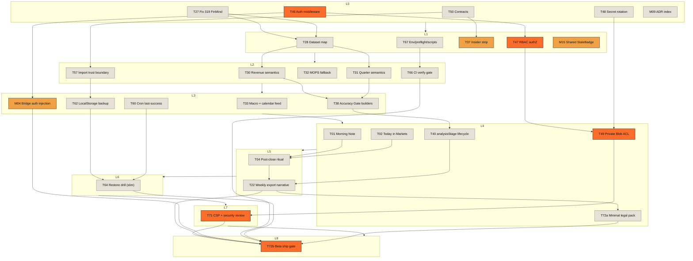

# 持倉看板 Task 2 TODO 與執行順序

更新時間：`2026-04-18 18:03 CST`

## 1. 簡介

R108 已把產品階段鎖定成 **internal beta**：先交付能安全示範、可驗證 correctness、能做 restore、能完成 owner signoff 的最小線。本頁只放 execution ledger，因此把 `69` 條 active workstream 拆成 `Ship-Before 30 / Beta+1 20 / Backlog 19`，並保留 Phase 2 debt、9 層 DAG、T-ID mapping 與 critical path，方便直接排程與驗收。

## 2. 30 條 Ship-Before

### 2.1 Product

| ID  | Title                                                                   | Category | Est. h | Depends     | Blocks    | Risk | Ship-level  |
| --- | ----------------------------------------------------------------------- | -------- | ------ | ----------- | --------- | ---- | ----------- |
| T01 | Surface Morning Note on Dashboard with deep-links                       | Product  | 6      | —           | T04,T22   | Med  | ship-before |
| T02 | Build Dashboard `Today in Markets` module                               | Product  | 8      | T32,T33     | T04,T22   | Med  | ship-before |
| T04 | Add post-close ritual mode + tomorrow-action editorial card             | Product  | 8      | T01,T02,T40 | T22       | Med  | ship-before |
| T22 | Deliver weekly export narrative + insider section; true PDF/cover later | Product  | 12     | T04,T40,T49 | T72a,T72b | High | ship-before |

### 2.2 Eng

| ID  | Title                                                                     | Category | Est. h | Depends     | Blocks            | Risk | Ship-level  |
| --- | ------------------------------------------------------------------------- | -------- | ------ | ----------- | ----------------- | ---- | ----------- |
| T37 | Strip insider buy/sell language in analyze/brain/analyst-reports/research | Eng      | 6      | T50         | T22,T23,T38       | High | ship-before |
| T38 | Enforce Accuracy Gate in all prompt builders                              | Eng      | 8      | T30,T31,T37 | T16,T40           | High | ship-before |
| T40 | Roll out `analysisStage` t0/t1 lifecycle and auto-confirm logic           | Eng      | 6      | T30,T31,T50 | T04,T14,T22       | High | ship-before |
| T46 | Add shared API auth middleware, fail-closed defaults, remove open CORS    | Eng      | 6      | —           | T47,T49,M04,T71   | High | ship-before |
| T47 | Add server-side `requirePortfolio` / RBAC authZ                           | Eng      | 8      | T46         | T49,T60,T72a,T72b | High | ship-before |
| T49 | Regrade Blob ACLs: private brain/research/snapshot, telemetry exception   | Eng      | 8      | T46,T47,T48 | T22,T71,T72a,T72b | High | ship-before |
| T50 | Add canonical contracts in `src/lib/contracts` + parse boundaries         | Eng      | 8      | —           | T37,T40,M15,T57   | High | ship-before |
| T57 | Add backup import trust boundary (allowlist/schema/confirm)               | Eng      | 4      | T50         | T62,T64           | Med  | ship-before |
| T71 | Add CSP/security headers + XSS/prompt-injection review                    | Eng      | 8      | T46,T49     | T72a,T72b         | High | ship-before |
| M15 | Build shared `<StaleBadge>` component as the stale/freshness UI primitive | Eng      | 4      | T50         | T09,T16,T25       | Med  | ship-before |

### 2.3 Data

| ID  | Title                                                                  | Category | Est. h | Depends | Blocks                  | Risk | Ship-level  |
| --- | ---------------------------------------------------------------------- | -------- | ------ | ------- | ----------------------- | ---- | ----------- |
| T27 | Fix FinMind `319 call-method-error` availability gap                   | Data     | 10     | —       | T28,T30,T31             | High | ship-before |
| T28 | Build authoritative FinMind dataset map + method registry              | Data     | 8      | T27     | T30,T31,T32,T33,T34,T36 | High | ship-before |
| T30 | Correct monthly revenue announced-month semantics end-to-end           | Data     | 6      | T27,T28 | T38,T40,T45             | High | ship-before |
| T31 | Correct quarter/H1/H2 financial semantics and derived standalone logic | Data     | 8      | T27,T28 | T38,T40,T45             | High | ship-before |
| T32 | Harden MOPS revenue/announcement ingestion and fallback contract       | Data     | 6      | T28     | T02,T12,T33             | Med  | ship-before |
| T33 | Add macro / 央行 / calendar feed for `Today in Markets`                | Data     | 6      | T32     | T02,T05,T12             | Med  | ship-before |

### 2.4 Ops

| ID  | Title                                                                       | Category | Est. h | Depends | Blocks      | Risk | Ship-level  |
| --- | --------------------------------------------------------------------------- | -------- | ------ | ------- | ----------- | ---- | ----------- |
| T48 | Rotate secrets, add inventory, Secret Manager, and launch-script cleanup    | Ops      | 6      | —       | T49,T60,T67 | High | ship-before |
| T60 | Add cron last-success markers and lateness alerts                           | Ops      | 6      | T47,T48 | T64,T72b    | High | ship-before |
| T62 | Extend checkpoint/backup contract to include localStorage                   | Ops      | 8      | T57     | T64,T72b    | High | ship-before |
| T64 | Run restore drill, rollback test, and MDD recovery test                     | Ops      | 5      | T60,T62 | T72b        | High | ship-before |
| M04 | Add Agent Bridge dashboard auth injection so T46 does not cause silent 401s | Ops      | 3      | T46     | T72b        | High | ship-before |

### 2.5 Testing

| ID  | Title                                        | Category | Est. h | Depends | Blocks | Risk | Ship-level  |
| --- | -------------------------------------------- | -------- | ------ | ------- | ------ | ---- | ----------- |
| T66 | Add GitHub CI workflow + `verify:local` gate | Testing  | 4      | T67     | T72b   | Med  | ship-before |

### 2.6 Docs

| ID   | Title                                                                                                                   | Category | Est. h | Depends                 | Blocks        | Risk | Ship-level  |
| ---- | ----------------------------------------------------------------------------------------------------------------------- | -------- | ------ | ----------------------- | ------------- | ---- | ----------- |
| T67  | Expand `.env.example`, clean launch scripts/inventory, add preflight, remove stale refs                                 | Docs     | 6      | T48,M09                 | T66,T72a,T72b | Med  | ship-before |
| T72a | Finish internal-beta minimal legal/docs pack: disclaimer, privacy-lite, data residency, audit schema, release checklist | Docs     | 5      | T22,T46,T47,T49,T67,T71 | T72b          | Med  | ship-before |
| T72b | Finish beta ship gate: smoke, owner signoff, demo path, invite/feedback readiness                                       | Docs     | 4      | T64,T66,T72a,M04        | —             | High | ship-before |
| M09  | Promote the 2026-04-11 staged-daily consensus into ADR/index so onboarding sees the true runtime contract               | Docs     | 2      | —                       | T67,T72b      | Low  | ship-before |

## 3. 20 條 Beta+1

| ID  | Title                                                                                               | Category | Est. h | Depends         | Blocks          | Risk | Ship-level |
| --- | --------------------------------------------------------------------------------------------------- | -------- | ------ | --------------- | --------------- | ---- | ---------- |
| T03 | Upgrade Daily Principle card to contextual quote + copy/share                                       | Product  | 4      | —               | T04,T22         | Low  | beta+1     |
| T05 | Surface anxiety indicators X1-X5 across dashboard/holdings/detail                                   | Product  | 12     | T08,T30,T31,T33 | T16,T24         | High | beta+1     |
| T06 | Finish multi-portfolio switcher smoke + edge states                                                 | Product  | 4      | T55             | T07,T24         | Med  | beta+1     |
| T07 | Complete multi-level holdings filters                                                               | Product  | 8      | T06,T08         | T24,T26         | Med  | beta+1     |
| T08 | Rebuild holdings detail pane on canonical `HoldingDossier`                                          | Product  | 12     | T35,T50         | T05,T07,T17     | High | beta+1     |
| T09 | Rewrite stale/data-gap UX in holdings rows and summaries                                            | Product  | 6      | T08,T16,T34     | T17,T24         | Med  | beta+1     |
| T12 | Polish news filters, objective summaries, and source/time badges                                    | Product  | 6      | T32,T33,T36     | T24,T26         | Med  | beta+1     |
| T14 | Finish streaming close-analysis UX and fallback states                                              | Product  | 8      | T38,T40         | T15,T24         | High | beta+1     |
| T15 | Ship same-day fast/confirmed diff and rerun cues                                                    | Product  | 6      | T40             | T04,T14         | Med  | beta+1     |
| T16 | Apply Accuracy Gate UI to every AI surface                                                          | Product  | 10     | T38,T50,M15     | T09,T14,T17     | High | beta+1     |
| T19 | Finish trade stepper/preview/apply + compliance memo UX                                             | Product  | 8      | T21,T57,T71     | T24,T26         | High | beta+1     |
| T21 | Complete `OperatingContext` on Trade/Log routes                                                     | Product  | 3      | T53,T54,T55     | T19,T20,T26     | Med  | beta+1     |
| T23 | Establish insider persona/compliance copy system cross-route                                        | Product  | 8      | T37             | T19,T22,T24     | High | beta+1     |
| T34 | Refine target-price lineage, freshness, and source labels                                           | Data     | 8      | T28,T32         | T09,T17,T22,T36 | High | beta+1     |
| T35 | Expand supply-chain/theme/company-profile enrichment                                                | Data     | 8      | T28             | T08,T17,T18,T42 | Med  | beta+1     |
| T36 | Normalize Gemini grounding merge policy + citations                                                 | Data     | 6      | T28,T34,T35     | T12,T45         | Med  | beta+1     |
| T52 | Add FinMind governor, endpoint boundary, and lint guardrail                                         | Eng      | 8      | T27,T28         | T38,T70         | High | beta+1     |
| T53 | Write AppShell state-ownership ADR/current-target matrix                                            | Eng      | 4      | —               | T21,T54,T55,T58 | Med  | beta+1     |
| T54 | Split `useAppRuntime` / `useAppRuntimeComposer` into bounded slices + resolve half-dead store state | Eng      | 12     | T53             | T21,T25,T55,T68 | High | beta+1     |
| T55 | Contain `useRoutePortfolioRuntime` and codify `/trade` write exception                              | Eng      | 8      | T53,T54         | T06,T21,T68     | High | beta+1     |

## 4. 19 條 Backlog

這一組不是「可忽略」，而是 **待 ship-before 完成後再開** 的後續 active workstream。A1/A2/B13/A3/A4 的聚合 debt 另外見 §5。

| ID  | Title                                                                                     | Category | Est. h | Depends                         | Blocks           | Risk | Ship-level |
| --- | ----------------------------------------------------------------------------------------- | -------- | ------ | ------------------------------- | ---------------- | ---- | ---------- |
| T11 | Complete events editorial hero/review queue + thesis/pillar feedback loop                 | Product  | 8      | T08,T39                         | T26,T45          | High | backlog    |
| T17 | Finish research backlog/data-gap center + explicit `coachLessons` injection               | Product  | 10     | T08,T34,T35,T45                 | T18,T22,T26      | High | backlog    |
| T18 | Surface four-persona scoring and explanation in research                                  | Product  | 8      | T17,T42                         | T22              | Med  | backlog    |
| T20 | Finish log reflection stats/filter/export UX                                              | Product  | 8      | T21,T26                         | T24              | Med  | backlog    |
| T24 | Complete mobile IA and responsive behaviors across core 5 routes                          | Product  | 10     | T06,T07,T12,T14,T17,T19,T20,T25 | T69              | Med  | backlog    |
| T25 | Fill empty/loading/error/skeleton states across core 5 routes                             | Product  | 12     | T54,M15                         | T24,T69          | Med  | backlog    |
| T26 | Finish cross-page handoff contract in UI, incl. `News -> Events/Daily`                    | Product  | 6      | T01,T11,T21                     | T20,T22          | Med  | backlog    |
| T29 | Normalize institutional labels end-to-end + regression                                    | Data     | 3      | T27,T28                         | T33,T40          | Med  | backlog    |
| T39 | Harden brain audit merge lifecycle and buckets                                            | Eng      | 8      | T38,T50                         | T11,T40,T45      | High | backlog    |
| T42 | Integrate four-persona runtime scoring contract                                           | Eng      | 6      | T35,T45                         | T18              | Med  | backlog    |
| T45 | Correct 600-rule knowledge base/provenance + clean live thesis narratives (6862 included) | Content  | 12     | T30,T31,T36                     | T17,T18,T42      | High | backlog    |
| T51 | Add snapshot `schemaVersion` normalize-on-read/write                                      | Eng      | 2      | T50                             | T40,T63,T64      | Med  | backlog    |
| T58 | Define service catalog, 3 SLOs, and incident thresholds                                   | Ops      | 6      | T53                             | T59,T60,T61,T72b | High | backlog    |
| T59 | Add structured logging schema + telemetry taxonomy + alert sink                           | Ops      | 8      | T58                             | T60,T61,T72b     | High | backlog    |
| T61 | Instrument web RUM + API/cron APM                                                         | Ops      | 6      | T58,T59                         | T72b             | Med  | backlog    |
| T63 | Add dataset fingerprint/manifest + replay diff tools                                      | Ops      | 6      | T51,T52                         | T64              | High | backlog    |
| T68 | Expand coverage to pages/components/store direct tests + route-shell prod guard           | Testing  | 8      | T50,T54,T55,T66                 | T69,T70          | High | backlog    |
| T69 | Add Playwright E2E for 3 golden flows + responsive smoke; visual suite later              | Testing  | 10     | T24,T25,T66,T68                 | T72b             | Med  | backlog    |
| T70 | Add maxDuration / cron schedule / rate-limit recovery tests                               | Testing  | 6      | T52,T60,T66,T68                 | T72b             | High | backlog    |

## 5. Phase 2 Top Debt

以下五條不是從 active list 消失，而是 **待 ship-before 完成後再開** 的聚合 debt：

### 5.1 A1 — god-hook 全拆（`useAppRuntimeComposer` / route runtime）

這一條代表的是 `T53/T54/T55` 後面的完整 Phase 2 refactor，不是今天先把 runtime ownership ADR 寫出來就算結束。ship-before 只要求把 ownership、route write exception、最低限度 slice boundary 講清；**真正 2183 LOC 級別的 runtime 拆解要等 ship-before 清完後再開**。

### 5.2 A2 — CSP 完整版 + 剩餘 security headers

ship-before 會先靠 `T71` 補最低限度 header 與 XSS / prompt-injection review，但完整 CSP、Referrer-Policy、Permissions-Policy 與 asset allowlist 不應混進本輪 beta gate。**Phase 2 再把 minimal hardening 升成 long-term policy**。

### 5.3 B13 — perf budget + bundle splitting

這不是「可有可無」，而是故意晚一拍。現在最先決的是 truthfulness、restore、auth、artifact ACL；等 ship-before 的 correctness boundary 站穩後，再把 bundle budget、manualChunks、route-level loading performance 收編成正式 perf contract。

### 5.4 A3 — route shell containment + `/trade` 例外治理

本輪文件已把 `/trade` 寫成明文 write 例外，但 **更深一層的 route-shell containment** 仍是 Phase 2 debt。ship-before 先做到「不要再畫錯、不要再假裝 route shell 是真 runtime」，Phase 2 才把 canonical runtime / migration shell 徹底分離。

### 5.5 A4 — backup import trust boundary 完整版

`T57` 先補 allowlist/schema/confirm 的最低邊界，但完整的 source signature、artifact provenance、回滾稽核與 replay diff，仍要等 `T63` 與 A1/A2 後續收口。ship-before 只求「匯入別再是任意 JSON 覆寫」；Phase 2 再把它變成真正的 restore platform。

## 6. 9 層 Mermaid DAG 執行順序

**DAG 判讀**

1. `T37` 已從 `T46/T47` 解鎖，只依賴 `T50`，因此可在 L1 與 auth/RBAC 平行開工。
2. `T46` authoritative 依賴是 `—`；`T48 → T46` 的舊偽 cycle 已移除。
3. `T72` 已拆成 `T72a`（最小 legal/docs pack）與 `T72b`（真正 ship gate）；`T73/T74/T75` 已內含於 `T72b`。
4. 最長 critical path 仍是 `T46 → T47 → T49 → T71 → T72b`。
5. 第二條長路徑是 `T27 → T28 → T30/T31 → T38 → T40 → T22 → T72b`，因此 data semantics 不是「可晚點補的 polish」。

## 7. T-ID 對應表

| T-ID | M-ID | R-name                                              | 新分類  | Ship-level  |
| ---- | ---- | --------------------------------------------------- | ------- | ----------- |
| T01  | —    | Morning Note on Dashboard                           | Product | ship-before |
| T02  | —    | Today in Markets module                             | Product | ship-before |
| T03  | —    | Daily Principle contextual card                     | Product | beta+1      |
| T04  | —    | Post-close ritual + tomorrow action                 | Product | ship-before |
| T05  | —    | X1-X5 anxiety indicators                            | Product | beta+1      |
| T06  | —    | Multi-portfolio switcher polish                     | Product | beta+1      |
| T07  | —    | Multi-level holdings filters                        | Product | beta+1      |
| T08  | —    | Canonical holdings detail pane                      | Product | beta+1      |
| T09  | —    | Stale/data-gap UX                                   | Product | beta+1      |
| T11  | —    | Events review loop (merged T10)                     | Product | backlog     |
| T12  | —    | News filters + objective summaries                  | Product | beta+1      |
| T14  | —    | Streaming close-analysis UX                         | Product | beta+1      |
| T15  | —    | Same-day diff + rerun cues                          | Product | beta+1      |
| T16  | —    | Accuracy Gate UI rollout                            | Product | beta+1      |
| T17  | —    | Research backlog center (merged T41)                | Product | backlog     |
| T18  | —    | Four-persona scoring surface                        | Product | backlog     |
| T19  | —    | Trade stepper / preview / apply UX                  | Product | beta+1      |
| T20  | —    | Log reflection stats / export UX                    | Product | backlog     |
| T21  | —    | `OperatingContext` on Trade/Log                     | Product | beta+1      |
| T22  | —    | Weekly export narrative + insider section           | Product | ship-before |
| T23  | —    | Insider cross-route copy system                     | Product | beta+1      |
| T24  | —    | Core-5 route mobile IA                              | Product | backlog     |
| T25  | —    | Core-5 empty/loading/error states                   | Product | backlog     |
| T26  | —    | Cross-page handoff contract (merged T13)            | Product | backlog     |
| T27  | —    | FinMind 319 availability fix                        | Data    | ship-before |
| T28  | —    | FinMind dataset registry                            | Data    | ship-before |
| T29  | —    | Institutional label normalization                   | Data    | backlog     |
| T30  | —    | Monthly revenue semantics                           | Data    | ship-before |
| T31  | —    | Quarter / H1 / H2 semantics                         | Data    | ship-before |
| T32  | —    | MOPS ingestion + fallback                           | Data    | ship-before |
| T33  | —    | Macro / 央行 / calendar feed                        | Data    | ship-before |
| T34  | —    | Target-price lineage + freshness                    | Data    | beta+1      |
| T35  | —    | Supply-chain / theme / profile enrichment           | Data    | beta+1      |
| T36  | —    | Gemini grounding merge policy                       | Data    | beta+1      |
| T37  | —    | Insider prompt strip                                | Eng     | ship-before |
| T38  | —    | Accuracy Gate in prompt builders                    | Eng     | ship-before |
| T39  | —    | Brain audit merge lifecycle                         | Eng     | backlog     |
| T40  | —    | `analysisStage` lifecycle                           | Eng     | ship-before |
| T42  | —    | Four-persona runtime scoring                        | Eng     | backlog     |
| T45  | —    | KB provenance + live thesis cleanup                 | Content | backlog     |
| T46  | —    | Shared API auth middleware                          | Eng     | ship-before |
| T47  | —    | Server-side RBAC authZ                              | Eng     | ship-before |
| T48  | —    | Secret rotation + Secret Manager                    | Ops     | ship-before |
| T49  | —    | Private Blob ACL + signed URL                       | Eng     | ship-before |
| T50  | —    | Canonical contracts                                 | Eng     | ship-before |
| T51  | —    | Snapshot `schemaVersion`                            | Eng     | backlog     |
| T52  | —    | FinMind governor + lint guardrail                   | Eng     | beta+1      |
| T53  | —    | AppShell state-ownership ADR                        | Eng     | beta+1      |
| T54  | —    | Runtime slice split (merged T56)                    | Eng     | beta+1      |
| T55  | —    | Route runtime containment + `/trade` exception      | Eng     | beta+1      |
| T57  | —    | Backup import trust boundary                        | Eng     | ship-before |
| T58  | —    | Service catalog + SLOs                              | Ops     | backlog     |
| T59  | —    | Structured logging + alert sink                     | Ops     | backlog     |
| T61  | —    | RUM + API/cron APM                                  | Ops     | backlog     |
| T62  | —    | Checkpoint includes localStorage                    | Ops     | ship-before |
| T63  | —    | Dataset manifest + replay diff                      | Ops     | backlog     |
| T64  | —    | Restore drill + rollback + MDD recovery             | Ops     | ship-before |
| T66  | —    | CI + `verify:local` gate                            | Testing | ship-before |
| T67  | —    | `.env.example` + launch hygiene bundle (merged T65) | Docs    | ship-before |
| T68  | —    | Page/component/store direct tests                   | Testing | backlog     |
| T69  | —    | 3 golden flows + responsive smoke                   | Testing | backlog     |
| T70  | —    | Cron / rate-limit / recovery tests                  | Testing | backlog     |
| T71  | —    | CSP + security headers + injection review           | Eng     | ship-before |
| T72a | —    | Internal-beta minimal legal/docs pack               | Docs    | ship-before |
| T72b | —    | Beta ship gate (folds old T73/T74/T75)              | Docs    | ship-before |
| —    | M04  | Agent Bridge dashboard auth injection               | Ops     | ship-before |
| —    | M09  | 2026-04-11 staged-daily ADR index                   | Docs    | ship-before |
| —    | M15  | Shared `<StaleBadge>` primitive                     | Eng     | ship-before |

## 8. critical path

1. Security / release path：`T46 → T47 → T49 → T71 → T72b`
2. Data semantics / content path：`T27 → T28 → T30/T31 → T38 → T40 → T22 → T72b`
3. `T72b` 是真正 ship gate，因此前面兩條鏈任一未完成，internal beta 都不能算 ready。
4. `T37`、`M04`、`T64`、`T66` 雖不在最長鏈上，但都是 release gate feeder；排程時不能把它們當成可無限後延的 side quest。

## 9. R118 QA Candidate Supplement

R118 補了 `12` 條 QA-specific candidate item，用來修正目前 Testing 只有 `T66/T68/T69/T70` 的偏輕問題。這一組**不併入原 69 條 active count**；用途是讓 owner 直接決定哪些升 ship-before、哪些留 beta+1。

完整 scenario matrix 與 3 persona 辯論見：`.tmp/portfolio-r8-loop/r118-qa-ops-supplement.md`

| ID  | Title                                                                                  | Category | Est. h | Depends         | Blocks   | Risk | Ship-level  |
| --- | -------------------------------------------------------------------------------------- | -------- | ------ | --------------- | -------- | ---- | ----------- |
| Q01 | Deep state coverage for holdings/news/events/dashboard/overview panels across 7 states | Testing  | 12     | T50,T68         | T69      | High | beta+1      |
| Q02 | Direct store unit tests for `brainStore` / `reportsStore` invariants                   | Testing  | 8      | T54,T66         | T68      | High | beta+1      |
| Q03 | Route-shell production guard runtime test under `NODE_ENV=production`                  | Testing  | 4      | T55,T66         | T72b     | High | ship-before |
| Q04 | Visual regression Playwright baseline for 8 pages + ship-before diff                   | Testing  | 10     | T69,T24,T25     | —        | Med  | beta+1      |
| Q05 | RBAC manual verification script with 5 persona scenarios + evidence checklist          | Testing  | 4      | T46,T47,M04     | T72b     | High | ship-before |
| Q06 | Cross-browser matrix with real iOS Safari priority                                     | Testing  | 6      | T66,T24         | T72b     | High | ship-before |
| Q07 | WCAG AA test pass: keyboard flow, labels, contrast, color-blind cues                   | Testing  | 6      | T66,T24,T25     | T72b     | High | ship-before |
| Q08 | Insider buy/sell prompt guard QA harness with mocked AI forbidden output               | Testing  | 4      | T37,T38,T50     | T22,T72b | High | ship-before |
| Q09 | Accuracy Gate 5-rule auto-tests across current AI entry points                         | Testing  | 6      | T38,T40,T50,M15 | T16,T72b | High | ship-before |
| Q10 | Performance regression gate for LCP/INP/CLS tied to `verify:local`                     | Testing  | 8      | T66,T69         | —        | Med  | beta+1      |
| Q11 | Multi-portfolio fast-switch stress test for state leak / stale bleed                   | Testing  | 6      | T06,T54,T55,Q02 | T24,T68  | Med  | beta+1      |
| Q12 | Backup import corrupt-file / schema-drift / oversized-file test suite                  | Testing  | 6      | T57,T62,T64     | T72b     | High | ship-before |

建議最小升級 bundle：`Q03 + Q05 + Q06 + Q08 + Q09 + Q12`，若 owner 對 demo-facing accessibility 敏感，再把 `Q07` 一起升 ship-before。

## 10. R118 Recurring Ops

這一組是 recurring ops，不和 `T48/T60/T62/T64` 這種一次性 ship task 混算。目的是把備份、配額、成本、儲存膨脹變成 weekly/monthly discipline，而不是事故後才回想起來。

| ID  | Title                                                   | Cadence | Trigger / Threshold                                | Evidence                                   | Risk if skipped                                 | Notes                         |
| --- | ------------------------------------------------------- | ------- | -------------------------------------------------- | ------------------------------------------ | ----------------------------------------------- | ----------------------------- |
| O01 | Weekly `git status` + remote backup freshness check     | Weekly  | every 7 days; alert if local commits unpushed > 7d | short ledger entry + branch/backups status | local-only work lost or stale backup assumption | aligns with Rule 4            |
| O02 | FinMind quota usage report (`600/1600 hr`)              | Daily   | daily check; warn at `600`, escalate at `1600`     | usage snapshot                             | provider quota exhausted without warning        | pairs with B10/Q10            |
| O03 | Restore drill rehearsal for A5/A6 lane                  | Monthly | once per month or before major demo                | restore evidence, duration, outcome        | restore path rots silently                      | extends `T64`                 |
| O04 | VM disk usage / SQLite-cache growth check               | Weekly  | unusual growth trend or low free space             | `df` snapshot + hot directories note       | cron/cache fills disk and breaks jobs           | keep lightweight              |
| O05 | PNG preview rotation and artifact size review           | Monthly | preview/artifact size drifts upward                | size ledger + deletions/archives note      | asset bloat repeats                             | manual is fine                |
| O06 | Blob storage stale snapshot / research artifact cleanup | Monthly | artifact exceeds retention window                  | cleanup ledger + retained exceptions       | storage cost and clutter drift                  | preserve audit-critical files |
| O07 | Vercel build minutes and deploy frequency review        | Monthly | month-end or abnormal spike                        | build-minute summary + push note           | cost creep breaks Rule 4 intent                 | trend review, not policing    |
| O08 | Claude + Codex token usage audit                        | Monthly | month-end or after heavy planning rounds           | coarse usage summary + outlier note        | AI cost drift invisible until invoice           | keep coarse-grained           |

最低必跑：`O01/O02/O03/O04`。`O05-O08` 先用手工 ledger 即可，不需要先為 2 人團隊搭一套厚重 SRE 平台。

## 11. R119 Executability Matrix

R119 不改原 69 條主表；改採 **stacked-card matrix** 補上每條 item 的 5 欄：

- Acceptance Criteria：done state，非 implementation hint
- Verify Command：shell 可 assert，無需人眼
- Sub-questions：若未在 `R120` 覆寫，一律採推薦 default
- Executor：`pure-codex` / `codex-then-review` / `user-manual-then-codex`
- Layer：採 R109 spine + conservative remap

11.1 Ship-Before · 30 + M04/M09/M15

| ID   | Acceptance Criteria                                                                                                                                                                      | Verify Command                                                                                                                                                                                     | Sub-questions                                                              | Executor                                                                                                     | Layer                                                           |
| ---- | ---------------------------------------------------------------------------------------------------------------------------------------------------------------------------------------- | -------------------------------------------------------------------------------------------------------------------------------------------------------------------------------------------------- | -------------------------------------------------------------------------- | ------------------------------------------------------------------------------------------------------------ | --------------------------------------------------------------- | ------------------------------------------- | ------------------- | ---- |
| T01  | 1. Dashboard renders Morning Note from runtime. 2. Card deep-links into target route(s). 3. Morning Note tests + build pass.                                                       | `npx vitest run tests/lib/morningNoteBuilder.test.js tests/hooks/useMorningNoteRuntime.test.jsx tests/components/dashboardPanel.test.jsx && npm run build`                                         | `Q-P1 default=08:30 pre-open`                                              | `codex-then-review`                                                                                          | `L4`                                                            |
| T02  | 1. Dashboard has `Today in Markets` module. 2. Source block stays tied to macro/央行/calendar feed. 3. Dashboard/runtime tests + build pass.                                       | `npx vitest run tests/components/dashboardPanel.test.jsx tests/lib/marketSyncRuntime.test.js && npm run build`                                                                                     | `Q-P3 default=minimal TW scope`                                            | `codex-then-review`                                                                                          | `L4`                                                            |
| T04  | 1. Post-close ritual mode can be entered from dashboard flow. 2. Tomorrow-action card respects `analysisStage` lifecycle. 3. Workflow tests + build pass.                          | `npx vitest run tests/hooks/usePostCloseSilentSync.test.jsx tests/hooks/useDailyAnalysisWorkflow.test.jsx && npm run build`                                                                        | `Q-P1 default=Morning Note stays pre-open`                                 | `codex-then-review`                                                                                          | `L5`                                                            |
| T22  | 1. Weekly export produces narrative + insider-safe branch. 2. Ship-before path does not depend on true PDF render. 3. Clipboard/export surface builds cleanly.                     | `rg -q "weekly\\                                                                                                                                                                                   | clipboard\\                                                                | insider" src/hooks/useWeeklyReportClipboard.js src/components/reports/DailyReportPanel.jsx && npm run build` | `Q-P2 default=clipboard+download`                               | `codex-then-review`                         | `L6`                |
| T37  | 1. analyze/brain/analyst-reports/research stop emitting buy/sell advice for insider lanes. 2. Non-insider flow stays intact. 3. Insider regression tests pass.                     | `npx vitest run tests/api/analyze.test.js tests/api/analyst-reports.test.js tests/lib/tradeAiResponse.test.js && rg -q "insider" api src`                                                          | `—`                                                                        | `pure-codex`                                                                                                 | `L1`                                                            |
| T38  | 1. All prompt builders apply the 5-rule Accuracy Gate before display. 2. Failure path is fail-closed with reason. 3. Prompt-builder tests pass.                                    | `npx vitest run tests/lib/analyzeRequest.test.js tests/lib/promptTemplateCatalog.test.js tests/api/analyze.test.js`                                                                                | `Q-D4 default=hard-block+reason`                                           | `pure-codex`                                                                                                 | `L3`                                                            |
| T40  | 1. Daily analysis supports `t0/t1` lifecycle. 2. Auto-confirm/rerun logic preserves same-day diff context. 3. Runtime/UI tests pass.                                               | `npx vitest run tests/lib/dailyAnalysisRuntime.test.js tests/hooks/useDailyAnalysisWorkflow.test.jsx tests/components/AppPanels.contexts.test.jsx`                                                 | `—`                                                                        | `pure-codex`                                                                                                 | `L3`                                                            |
| T46  | 1. Shared API auth middleware exists. 2. Protected routes fail-closed and remove open CORS defaults. 3. Protected API tests pass.                                                  | `test -f api/_lib/auth.js && npx vitest run tests/api/analyze.test.js tests/api/research.test.js tests/api/news-feed.test.js`                                                                      | `Q-I2 default=Node runtime`                                                | `pure-codex`                                                                                                 | `L0`                                                            |
| T47  | 1. `requirePortfolio()` runs server-side at route entry. 2. admin/user scope behaves per architecture RBAC. 3. API authZ tests pass.                                               | `npx vitest run tests/api/analyze.test.js tests/api/research.test.js tests/api/analyst-reports.test.js && rg -q "requirePortfolio" api`                                                            | `—`                                                                        | `pure-codex`                                                                                                 | `L1`                                                            |
| T49  | 1. brain/research/snapshot artifacts are private. 2. Browser reads via signed URL only; telemetry remains public exception. 3. Build and ACL grep verify pass.                     | `rg -q "signed URL\\                                                                                                                                                                               | private" api src docs && npm run build`                                    | `Q-D3 default=TTL 15m`                                                                                       | `user-manual-then-codex`                                        | `L3`                                        |
| T50  | 1. Canonical contracts live under `src/lib/contracts`. 2. Parse boundaries reject invalid ingress payloads. 3. Contract tests pass.                                                | `test -d src/lib/contracts && npx vitest run tests/lib/dossierUtils.buildHoldingDossiers.test.js tests/api/parse.test.js tests/lib/analyzeRequest.test.js`                                         | `Q-D1 default=strict reject`                                               | `pure-codex`                                                                                                 | `L0`                                                            |
| T57  | 1. Backup import enforces allowlist/schema/confirm boundary. 2. Invalid payload cannot mutate runtime state. 3. Backup persistence tests pass.                                     | `npx vitest run tests/hooks/usePortfolioPersistence.test.jsx tests/hooks/usePortfolioSnapshotRuntime.test.jsx && rg -q "schemaVersion\\                                                            | confirm" src hooks api tests`                                              | `Q-D1 default=strict reject`                                                                                 | `pure-codex`                                                    | `L2`                                        |
| T71  | 1. Security headers/CSP minimum set lands on app/API surfaces. 2. Prompt-injection / XSS review artifacts exist. 3. Config/API tests pass.                                         | `npx vitest run tests/vercel-config.test.js tests/api/analyze.test.js && rg -q "Content-Security-Policy\\                                                                                          | X-Frame-Options\\                                                          | Referrer-Policy" vercel.json api src`                                                                        | `Q-D3 default=TTL 15m; Q-I2 default=Node`                       | `codex-then-review`                         | `L4`                |
| M15  | 1. Shared `<StaleBadge>` primitive exists. 2. Stale/degraded states consume it instead of ad-hoc copy. 3. Holdings/runtime tests pass.                                             | `test -f src/components/common/StaleBadge.jsx && npx vitest run tests/components/holdingsPanel.test.jsx tests/components/AppPanels.contexts.test.jsx tests/hooks/usePortfolioDerivedData.test.jsx` | `Q-D2 default=7d/30d/1d thresholds`                                        | `pure-codex`                                                                                                 | `L2`                                                            |
| T27  | 1. FinMind `319` availability gap is handled. 2. dataset availability/audit stays reproducible. 3. FinMind + KB tests pass.                                                        | `npx vitest run tests/api/finmind.test.js tests/lib/finmindAdapter.test.js tests/lib/knowledge-base.test.js && node scripts/audit-kb-availability.mjs`                                             | `—`                                                                        | `pure-codex`                                                                                                 | `L0`                                                            |
| T28  | 1. Dataset map + method registry is authoritative. 2. Callers use canonical registry path. 3. Data-adapter tests pass.                                                             | `npx vitest run tests/api/finmind.test.js tests/lib/finmindAdapter.test.js tests/lib/dataAdapters.test.js`                                                                                         | `—`                                                                        | `pure-codex`                                                                                                 | `L1`                                                            |
| T30  | 1. Monthly revenue uses announced-month semantics correctly. 2. Downstream consumers stop mixing announcement month with business month. 3. Fundamentals tests pass.               | `npx vitest run tests/api/finmind.test.js tests/lib/finmindFundamentalsMapper.test.js`                                                                                                             | `—`                                                                        | `pure-codex`                                                                                                 | `L2`                                                            |
| T31  | 1. Quarter/H1/H2 standalone semantics are corrected. 2. Derived quarterly values stop leaking cumulative totals. 3. Fundamentals tests pass.                                       | `npx vitest run tests/api/finmind.test.js tests/lib/finmindFundamentalsMapper.test.js`                                                                                                             | `—`                                                                        | `pure-codex`                                                                                                 | `L2`                                                            |
| T32  | 1. MOPS ingestion fallback contract exists. 2. Revenue/announcement path degrades honestly on provider failure. 3. Adapter/event tests pass.                                       | `npx vitest run tests/lib/dataAdapters.test.js tests/api/event-calendar.test.js && rg -q "mops" api src`                                                                                           | `—`                                                                        | `pure-codex`                                                                                                 | `L3`                                                            |
| T33  | 1. Macro/央行/calendar feed is available to dashboard/news lanes. 2. Source path is explicit and not AI-only inferred. 3. Market/event tests pass.                                 | `npx vitest run tests/api/event-calendar.test.js tests/lib/marketSyncRuntime.test.js && npm run build`                                                                                             | `Q-P3 default=minimal TW scope`                                            | `pure-codex`                                                                                                 | `L3`                                                            |
| T48  | 1. Secrets are rotated in real secret store. 2. Inventory + launch cleanup reflect current names only. 3. Repo side no stale secret refs remain.                                   | `rg -q "CRON_SECRET\\                                                                                                                                                                              | FINMIND\\                                                                  | BLOB" .env.example scripts docs`                                                                             | `Q-I1 default=90d cadence`                                      | `user-manual-then-codex`                    | `L0`                |
| T60  | 1. Cron jobs emit last-success markers. 2. Lateness alert rule exists. 3. Cron/config tests pass.                                                                                  | `npx vitest run tests/vercel-config.test.js tests/api/collect-target-prices.test.js tests/api/collectNews.test.js && rg -q "last-success\\                                                         | lateness" api scripts src`                                                 | `Q-I3 default=03:00 snapshot`                                                                                | `pure-codex`                                                    | `L2`                                        |
| T62  | 1. Checkpoint/backup includes localStorage truth. 2. Restore path covers browser-local state, not just Blob artifact. 3. Persistence tests pass.                                   | `npx vitest run tests/hooks/usePortfolioPersistence.test.jsx tests/hooks/usePortfolioSnapshotRuntime.test.jsx`                                                                                     | `Q-I3 default=03:00 snapshot`                                              | `pure-codex`                                                                                                 | `L3`                                                            |
| T64  | 1. Restore drill is repeatable and evidenced. 2. Rollback + MDD recovery path are documented and tested. 3. Restore runbook exists.                                                | `test -f docs/runbooks/restore-drill.md && npx vitest run tests/hooks/usePortfolioPersistence.test.jsx tests/hooks/usePortfolioSnapshotRuntime.test.jsx tests/api/portfolio-snapshots.test.js`     | `Q-I3 default=monthly restore; Q-I4 default=retain evidence`               | `user-manual-then-codex`                                                                                     | `L7`                                                            |
| M04  | 1. Agent Bridge gets auth injection path compatible with fail-closed APIs. 2. Missing bridge auth no longer results in silent blank 401 state. 3. Build + bridge grep verify pass. | `rg -q "bridge.\*auth\\                                                                                                                                                                            | auth.\*bridge" api/debug-bridge-auth.js scripts docs src && npm run build` | `—`                                                                                                          | `user-manual-then-codex`                                        | `L2`                                        |
| T66  | 1. CI workflow exists. 2. Workflow runs `verify:local` as authoritative gate. 3. Repo passes local verify.                                                                         | `test -f .github/workflows/ci.yml && npm run verify:local`                                                                                                                                         | `—`                                                                        | `pure-codex`                                                                                                 | `L2`                                                            |
| T67  | 1. `.env.example` matches real runtime contract. 2. launch scripts / preflight / stale refs are cleaned. 3. Runtime-entry + fast-refresh checks pass.                              | `rg -q "FINMIND\\                                                                                                                                                                                  | BLOB\\                                                                     | CRON" .env.example && npm run check:runtime-entry && npm run check:fast-refresh`                             | `Q-I1 default=90d cadence`                                      | `pure-codex`                                | `L1`                |
| T72a | 1. disclaimer/privacy-lite/residency/audit/release checklist doc set exists. 2. Docs match current RBAC/ACL/runtime truth. 3. Checklist files are linkable.                        | `rg -q "disclaimer\\                                                                                                                                                                               | privacy\\                                                                  | residency\\                                                                                                  | audit" docs && test -f docs/release/internal-beta-checklist.md` | `Q-P2 default=no email; M-U4 legal signoff` | `codex-then-review` | `L7` |
| T72b | 1. smoke + owner signoff + demo path + invite readiness are bundled. 2. Evidence pack exists for auth/RBAC/insider/restore/iPhone smoke. 3. Full local verify passes.              | `npm run verify:local && test -f docs/release/internal-beta-signoff.md`                                                                                                                            | `M-U3 iPhone smoke; M-U4 owner signoff`                                    | `user-manual-then-codex`                                                                                     | `L8`                                                            |
| M09  | 1. 2026-04-11 staged-daily consensus is promoted to ADR/index. 2. onboarding docs stop pointing at stale runtime assumptions. 3. Docs grep + build pass.                           | `rg -q "2026-04-11\\                                                                                                                                                                               | staged-daily" docs/decisions/index.md docs && npm run build`               | `—`                                                                                                          | `pure-codex`                                                    | `L0`                                        |

11.2 Beta+1 · 20

| ID  | Acceptance Criteria                                                                                                                                                 | Verify Command                                                                                                                                                     | Sub-questions                              | Executor            | Layer        |
| --- | ------------------------------------------------------------------------------------------------------------------------------------------------------------------- | ------------------------------------------------------------------------------------------------------------------------------------------------------------------ | ------------------------------------------ | ------------------- | ------------ | ---- |
| T03 | 1. Daily Principle card becomes contextual quote/card, not placeholder copy. 2. Copy/share interaction exists. 3. Dashboard/overview build passes.            | `npx vitest run tests/components/dashboardPanel.test.jsx tests/components/overviewPanel.concentration.test.jsx && npm run build`                                   | `Q-P4 default=copy only`                   | `codex-then-review` | `L4`         |
| T05 | 1. X1-X5 indicators surface across promised routes. 2. Inputs tie back to canonical dossier/market semantics. 3. Related panel tests pass.                    | `npx vitest run tests/lib/investorProfile.test.js tests/components/holdingsPanel.test.jsx tests/components/dashboardPanel.test.jsx && npm run build`               | `—`                                        | `codex-then-review` | `L6`         |
| T06 | 1. Multi-portfolio switcher handles smoke + edge states cleanly. 2. PID-scoped state does not leak on switch. 3. Route/runtime tests pass.                    | `npx vitest run tests/hooks/useRoutePortfolioRuntime.test.jsx tests/routes/portfolioLayout.routes.test.jsx && npm run build`                                       | `—`                                        | `codex-then-review` | `L6`         |
| T07 | 1. Holdings filters support intended depth. 2. Filter state survives route/runtime rules. 3. Holdings tests pass.                                             | `npx vitest run tests/hooks/useRouteHoldingsPage.test.jsx tests/components/holdingsPanel.test.jsx && npm run build`                                                | `—`                                        | `codex-then-review` | `L6`         |
| T08 | 1. Holdings detail pane reads canonical `HoldingDossier` only. 2. Old ad-hoc detail derivation path is removed or bypassed. 3. Dossier/holdings tests pass.   | `npx vitest run tests/lib/dossierUtils.buildHoldingDossiers.test.js tests/hooks/usePortfolioDerivedData.test.jsx tests/components/holdingsPanel.test.jsx`          | `—`                                        | `codex-then-review` | `L5`         |
| T09 | 1. Holdings rows/summaries show stale/data-gap UX consistently. 2. Degraded mode is visible, not silent. 3. Holdings/runtime tests pass.                      | `npx vitest run tests/components/holdingsPanel.test.jsx tests/hooks/usePortfolioDerivedData.test.jsx && npm run build`                                             | `Q-D2 default=7d/30d/1d thresholds`        | `codex-then-review` | `L6`         |
| T12 | 1. News filters/objective summaries/source-time badges are coherent. 2. Summary lane stays objective, not opinion drift. 3. News route tests pass.            | `npx vitest run tests/hooks/useRouteNewsPage.test.jsx tests/components/newsAnalysisPanel.test.jsx tests/api/news-feed.test.js && npm run build`                    | `Q-P3 default=minimal TW scope`            | `codex-then-review` | `L5`         |
| T14 | 1. Streaming close-analysis UX handles loading/error/fallback states. 2. Streaming surface matches `analysisStage` truth. 3. Analysis UI tests pass.          | `npx vitest run tests/hooks/useDailyAnalysisWorkflow.test.jsx tests/components/AppPanels.contexts.test.jsx && npm run build`                                       | `—`                                        | `codex-then-review` | `L4`         |
| T15 | 1. Same-day fast/confirmed diff is visible. 2. Rerun cues preserve comparison context. 3. Diff/runtime tests pass.                                            | `npx vitest run tests/lib/dailyReportDiff.test.js tests/hooks/useDailyAnalysisWorkflow.test.jsx && npm run build`                                                  | `—`                                        | `codex-then-review` | `L4`         |
| T16 | 1. Accuracy Gate UI lands on every AI surface. 2. Blocked/degraded states are explicit. 3. Surface tests pass.                                                | `npx vitest run tests/components/AppPanels.contexts.test.jsx tests/components/newsAnalysisPanel.test.jsx tests/components/researchPanel.test.jsx && npm run build` | `Q-D4 default=hard-block+reason`           | `codex-then-review` | `L5`         |
| T19 | 1. Trade stepper/preview/apply flow is complete. 2. Compliance memo is generated and attached to write path. 3. Trade tests pass.                             | `npx vitest run tests/components/tradePanel.dialogs.test.jsx tests/hooks/useRouteTradePage.test.jsx tests/lib/tradeParseUtils.test.js && npm run build`            | `Q-P5 default=preview+confirm+audit`       | `codex-then-review` | `L7`         |
| T21 | 1. Trade/Log routes render `OperatingContext` from runtime truth. 2. Context stops being shell-only decoration. 3. Route tests pass.                          | `npx vitest run tests/hooks/useRouteTradePage.test.jsx tests/hooks/useRouteLogPage.test.jsx tests/components/AppPanels.contexts.test.jsx && npm run build`         | `—`                                        | `codex-then-review` | `L6`         |
| T23 | 1. Insider persona/compliance copy system is consistent cross-route. 2. No route backslides into action language. 3. Related route tests/build pass.          | `npx vitest run tests/api/analyze.test.js tests/components/newsAnalysisPanel.test.jsx tests/components/researchPanel.test.jsx && npm run build`                    | `Q-P5 default=preview+confirm+audit`       | `codex-then-review` | `L6`         |
| T34 | 1. Target-price lineage/freshness/source labels are explicit. 2. Aggregate path remains honest about provenance. 3. Target tests pass.                        | `npx vitest run tests/api/target-prices.test.js tests/lib/finmindTargetsMapper.test.js tests/hooks/usePortfolioDerivedData.test.jsx`                               | `Q-D2 default=targets 7d`                  | `pure-codex`        | `L4`         |
| T35 | 1. Supply-chain/theme/company-profile enrichment is canonicalized. 2. Enrichment feeds dossier/research lanes without ad-hoc joins. 3. Enrichment tests pass. | `npx vitest run tests/lib/dossierSupplyChain.test.js tests/lib/stockClassifier.test.js tests/hooks/usePortfolioDerivedData.test.jsx`                               | `—`                                        | `pure-codex`        | `L4`         |
| T36 | 1. Gemini grounding merge policy is documented in code path. 2. Citations survive merge without becoming authoritative facts. 3. Research tests pass.         | `npx vitest run tests/api/research-type-awareness.test.js tests/api/research.test.js tests/components/researchPanel.test.jsx && npm run build`                     | `—`                                        | `codex-then-review` | `L4`         |
| T52 | 1. FinMind governor guards endpoint boundary. 2. New callers trip lint/runtime guardrail. 3. Data/config tests pass.                                          | `npx vitest run tests/api/finmind.test.js tests/lib/finmindAdapter.test.js tests/vercel-config.test.js && npm run lint`                                            | `—`                                        | `pure-codex`        | `L2`         |
| T53 | 1. AppShell state-ownership ADR exists. 2. current-target matrix is explicit enough to guide refactor work. 3. Doc grep/build pass.                           | `rg -q "state-ownership\\                                                                                                                                          | current-target" docs src && npm run build` | `—`                 | `pure-codex` | `L0` |
| T54 | 1. `useAppRuntime` / `useAppRuntimeComposer` are split into bounded slices. 2. Half-dead store state is removed or isolated. 3. Runtime hook tests pass.      | `npx vitest run tests/hooks/useAppRuntimeComposer.test.jsx tests/hooks/useAppRuntimeState.test.jsx tests/lib/appShellRuntime.test.js`                              | `—`                                        | `pure-codex`        | `L1`         |
| T55 | 1. `useRoutePortfolioRuntime` is contained. 2. `/trade` write exception is codified, not implied. 3. Route/runtime tests pass.                                | `npx vitest run tests/hooks/useRoutePortfolioRuntime.test.jsx tests/routes/portfolioLayout.routes.test.jsx tests/hooks/useRouteTradePage.test.jsx`                 | `—`                                        | `pure-codex`        | `L2`         |

11.3 Backlog · 19

| ID  | Acceptance Criteria                                                                                                                                                    | Verify Command                                                                                                                                                                               | Sub-questions                               | Executor                                                         | Layer                                    |
| --- | ---------------------------------------------------------------------------------------------------------------------------------------------------------------------- | -------------------------------------------------------------------------------------------------------------------------------------------------------------------------------------------- | ------------------------------------------- | ---------------------------------------------------------------- | ---------------------------------------- | ------------------------ | ---- |
| T11 | 1. Events hero/review queue writes back thesis/pillar loop. 2. Review queue stops being UI-only chrome. 3. Events runtime tests pass.                            | `npx vitest run tests/hooks/useRouteEventsPage.test.jsx tests/components/eventsPanel.test.jsx tests/lib/eventReviewRuntime.test.js && npm run build`                                         | `—`                                         | `codex-then-review`                                              | `L6`                                     |
| T17 | 1. Research backlog/data-gap center exists. 2. `coachLessons` injection is explicit and auditable. 3. Research tests pass.                                       | `npx vitest run tests/hooks/useResearchWorkflow.test.jsx tests/components/researchPanel.test.jsx tests/lib/researchRuntime.test.js && npm run build`                                         | `—`                                         | `codex-then-review`                                              | `L7`                                     |
| T18 | 1. Four-persona scoring is visible in research surface. 2. Explanation stays short and policy-safe. 3. Persona/research tests pass.                              | `npx vitest run tests/lib/personaEngine.test.js tests/components/researchPanel.test.jsx && npm run build`                                                                                    | `Q-D5 default=score+short reason`           | `codex-then-review`                                              | `L8`                                     |
| T20 | 1. Log route supports reflection stats/filter/export. 2. Export respects route/runtime ownership. 3. Log route tests pass.                                       | `npx vitest run tests/hooks/useRouteLogPage.test.jsx tests/lib/reportUtils.test.js && npm run build`                                                                                         | `—`                                         | `codex-then-review`                                              | `L8`                                     |
| T24 | 1. Core 5 routes have stable mobile IA/responsive behavior. 2. Route transitions remain understandable on mobile. 3. Build and route-shell tests pass.           | `npx vitest run tests/routes/portfolioLayout.routes.test.jsx tests/components/AppShellFrame.test.jsx && npm run build`                                                                       | `Q-I5 default=real iPhone signoff`          | `codex-then-review`                                              | `L8`                                     |
| T25 | 1. Empty/loading/error/skeleton states cover core 5 routes. 2. State names match truth/degraded semantics. 3. Panel tests pass.                                  | `npx vitest run tests/components/AppPanels.contexts.test.jsx tests/components/dashboardPanel.test.jsx tests/components/holdingsPanel.test.jsx && npm run build`                              | `Q-D2 default=consistent stale semantics`   | `codex-then-review`                                              | `L5`                                     |
| T26 | 1. Cross-page handoff contract is explicit in UI. 2. `News -> Events/Daily` handoff is consistent and testable. 3. Route action tests pass.                      | `npx vitest run tests/routes/routePages.actions.test.jsx tests/hooks/useRouteNewsPage.test.jsx tests/hooks/useRouteDailyPage.test.jsx && npm run build`                                      | `—`                                         | `codex-then-review`                                              | `L7`                                     |
| T29 | 1. Institutional labels normalize end-to-end. 2. UI/data no longer disagree on foreign/dealer labels. 3. FinMind tests pass.                                     | `npx vitest run tests/api/finmind.test.js tests/lib/finmindAdapter.test.js`                                                                                                                  | `—`                                         | `pure-codex`                                                     | `L2`                                     |
| T39 | 1. Brain audit merge lifecycle has explicit buckets and merge rules. 2. Audit trail is queryable and not mixed with live narrative. 3. Brain/runtime tests pass. | `npx vitest run tests/lib/brainRuntime.test.js tests/lib/knowledgeEvolutionRuntime.test.js tests/lib/runtimeLogger.test.js`                                                                  | `—`                                         | `pure-codex`                                                     | `L4`                                     |
| T42 | 1. Four-persona runtime scoring contract exists. 2. Research surface consumes canonical contract instead of ad-hoc scoring. 3. Persona/runtime tests pass.       | `npx vitest run tests/lib/personaEngine.test.js tests/lib/researchRuntime.test.js && npm run build`                                                                                          | `Q-D5 default=score+short reason`           | `pure-codex`                                                     | `L7`                                     |
| T45 | 1. KB provenance is corrected across live thesis narratives. 2. 6862 and related content stop claiming unsupported truth. 3. KB/research tests pass.             | `npx vitest run tests/lib/knowledge-base.test.js tests/api/research.test.js tests/api/research-type-awareness.test.js`                                                                       | `—`                                         | `codex-then-review`                                              | `L5`                                     |
| T51 | 1. Snapshot `schemaVersion` is normalized on read/write. 2. Old snapshot shape cannot silently bypass migration path. 3. Snapshot tests pass.                    | `npx vitest run tests/hooks/usePortfolioPersistence.test.jsx tests/hooks/usePortfolioSnapshotRuntime.test.jsx tests/api/portfolio-snapshots.test.js`                                         | `Q-D1 default=strict reject`                | `pure-codex`                                                     | `L1`                                     |
| T58 | 1. Service catalog and 3 SLOs exist. 2. Incident thresholds are explicit enough to drive alert policy. 3. Docs exist under ops lane.                             | `rg -q "service catalog\\                                                                                                                                                                    | SLO\\                                       | incident threshold" docs && test -f docs/ops/service-catalog.md` | `Q-I4 default=logs 180d`                 | `codex-then-review`      | `L2` |
| T59 | 1. Structured logging schema/taxonomy/alert sink are defined. 2. Runtime emits consistent event names. 3. Logging/runtime tests pass.                            | `npx vitest run tests/lib/runtimeLogger.test.js tests/api/analyze.test.js && rg -q "taxonomy\\                                                                                               | alert sink" docs src api`                   | `Q-I4 default=logs 180d`                                         | `codex-then-review`                      | `L3`                     |
| T61 | 1. Web RUM + API/cron APM are instrumented. 2. Metrics flow to agreed observability sink. 3. Build passes with instrumentation.                                  | `rg -q "web-vitals\\                                                                                                                                                                         | apm\\                                       | trace" src api docs && npm run build`                            | `Q-I2 default=Node; M-U1 dashboard sink` | `user-manual-then-codex` | `L4` |
| T63 | 1. Dataset manifest/fingerprint/replay diff tools exist. 2. Restore lane can diff replayed artifacts. 3. Snapshot/data tests pass.                               | `npx vitest run tests/api/portfolio-snapshots.test.js tests/lib/dataAdapters.test.js && rg -q "manifest\\                                                                                    | replay diff" docs src api`                  | `Q-I4 default=30d stale artifact retention`                      | `pure-codex`                             | `L4`                     |
| T68 | 1. Page/component/store direct tests expand beyond current shallow set. 2. Route-shell prod guard is covered in direct tests. 3. Expanded test suite passes.     | `npx vitest run tests/components/holdingsPanel.test.jsx tests/components/newsAnalysisPanel.test.jsx tests/hooks/useAppRuntimeComposer.test.jsx tests/routes/portfolioLayout.routes.test.jsx` | `—`                                         | `pure-codex`                                                     | `L4`                                     |
| T69 | 1. 3 golden flows + responsive smoke exist in Playwright. 2. Route-level E2E is reproducible in CI/local. 3. Playwright artifacts are storable.                  | `rg -q "playwright" tests .github docs && npm run verify:local`                                                                                                                              | `Q-I5 default=real iPhone + scripted smoke` | `codex-then-review`                                              | `L8`                                     |
| T70 | 1. maxDuration / cron schedule / rate-limit recovery tests exist. 2. Cron pipeline stops relying on folklore. 3. Config/cron tests pass.                         | `npx vitest run tests/vercel-config.test.js tests/api/collect-target-prices.test.js tests/api/collectNews.test.js`                                                                           | `—`                                         | `pure-codex`                                                     | `L5`                                     |

11.4 R118 QA Candidate Supplement · Q01-Q12

| ID  | Acceptance Criteria                                                                                                                                             | Verify Command                                                                                                                                                                                                              | Sub-questions                        | Executor                                                            | Layer                        |
| --- | --------------------------------------------------------------------------------------------------------------------------------------------------------------- | --------------------------------------------------------------------------------------------------------------------------------------------------------------------------------------------------------------------------- | ------------------------------------ | ------------------------------------------------------------------- | ---------------------------- | ------------------- | ---- |
| Q01 | 1. holdings/news/events/dashboard/overview each cover 7 states. 2. State names align with degraded/insider/stale semantics. 3. Expanded panel tests pass. | `npx vitest run tests/components/dashboardPanel.test.jsx tests/components/holdingsPanel.test.jsx tests/components/eventsPanel.test.jsx tests/components/newsAnalysisPanel.test.jsx tests/components/researchPanel.test.jsx` | `Q-D2 default=shared thresholds`     | `pure-codex`                                                        | `L5`                         |
| Q02 | 1. `brainStore` / `reportsStore` have direct invariant tests. 2. Store regressions no longer hide behind route integration. 3. Store suite passes.        | `test -f tests/stores/brainStore.test.js && test -f tests/stores/reportsStore.test.js && npx vitest run tests/stores/*.test.js`                                                                                             | `—`                                  | `pure-codex`                                                        | `L3`                         |
| Q03 | 1. route-shell production guard is tested under prod env. 2. Write paths outside `/trade` stay blocked. 3. Prod-guard tests pass.                         | `npx vitest run tests/routes/portfolioLayout.routes.test.jsx tests/hooks/useRoutePortfolioRuntime.test.jsx && rg -q "NODE_ENV" tests src`                                                                                   | `—`                                  | `pure-codex`                                                        | `L3`                         |
| Q04 | 1. 8-page visual baseline exists. 2. ship-before diffs can be compared non-manually. 3. Playwright visual files are runnable.                             | `rg -q "toHaveScreenshot\\                                                                                                                                                                                                  | visual" tests docs && npm run build` | `Q-I5 default=real iPhone separate from visual lane`                | `codex-then-review`          | `L7`                |
| Q05 | 1. RBAC manual verification script exists. 2. Script includes 5 persona scenarios + evidence columns. 3. Checklist file is grep-verifiable.               | `test -f docs/runbooks/rbac-manual-verification.md && rg -q "admin\\                                                                                                                                                        | 403\\                                | portfolio" docs/runbooks/rbac-manual-verification.md`               | `—`                          | `codex-then-review` | `L3` |
| Q06 | 1. Cross-browser matrix exists with iOS Safari first-class. 2. Three critical routes have explicit pass/fail evidence slots. 3. Matrix file exists.       | `test -f docs/qa/cross-browser-matrix.md && rg -q "iOS Safari" docs/qa/cross-browser-matrix.md`                                                                                                                             | `Q-I5 default=real iPhone`           | `user-manual-then-codex`                                            | `L7`                         |
| Q07 | 1. WCAG AA smoke pack covers keyboard/labels/contrast/color-blind cues. 2. Non-color-only signal is documented. 3. Checklist/build pass.                  | `test -f docs/qa/accessibility-checklist.md && rg -q "keyboard\\                                                                                                                                                            | contrast\\                           | screen reader" docs/qa/accessibility-checklist.md && npm run build` | `—`                          | `codex-then-review` | `L7` |
| Q08 | 1. Insider forbidden-output harness exists. 2. Mocked AI buy/sell text is blocked before render. 3. Insider harness tests pass.                           | `npx vitest run tests/api/analyze.test.js tests/api/analyst-reports.test.js tests/lib/tradeAiResponse.test.js && rg -q "insider" tests src api`                                                                             | `—`                                  | `pure-codex`                                                        | `L4`                         |
| Q09 | 1. Accuracy Gate 5 rules each have auto-tests. 2. Current AI entry points are covered. 3. Gate tests pass.                                                | `npx vitest run tests/lib/analyzeRequest.test.js tests/api/analyze.test.js tests/components/AppPanels.contexts.test.jsx && rg -q "Accuracy Gate" tests src docs`                                                            | `Q-D4 default=hard-block+reason`     | `pure-codex`                                                        | `L4`                         |
| Q10 | 1. LCP/INP/CLS gate is defined and scriptable. 2. `verify:local` can call the perf gate. 3. Perf docs/scripts exist.                                      | `rg -q "LCP\\                                                                                                                                                                                                               | INP\\                                | CLS" scripts tests docs && npm run build`                           | `—`                          | `codex-then-review` | `L7` |
| Q11 | 1. Multi-portfolio fast-switch stress test exists. 2. State leak/stale bleed are asserted directly. 3. Runtime tests pass.                                | `npx vitest run tests/hooks/useRoutePortfolioRuntime.test.jsx tests/hooks/usePortfolioBootstrap.test.jsx tests/routes/portfolioLayout.routes.test.jsx && npm run build`                                                     | `—`                                  | `pure-codex`                                                        | `L7`                         |
| Q12 | 1. Corrupt-file/schema-drift/oversized backup tests exist. 2. Import path cannot silently mutate state on bad file. 3. Backup tests pass.                 | `npx vitest run tests/hooks/usePortfolioPersistence.test.jsx tests/hooks/usePortfolioSnapshotRuntime.test.jsx tests/api/portfolio-snapshots.test.js && rg -q "schemaVersion\\                                               | oversized\\                          | corrupt" tests src`                                                 | `Q-D1 default=strict reject` | `pure-codex`        | `L8` |

11.5 R118 Recurring Ops · O01-O08

| ID  | Acceptance Criteria                                                                                                                             | Verify Command                                                                                      | Sub-questions                                     | Executor                                | Layer                    |
| --- | ----------------------------------------------------------------------------------------------------------------------------------------------- | --------------------------------------------------------------------------------------------------- | ------------------------------------------------- | --------------------------------------- | ------------------------ | ---- |
| O01 | 1. Weekly backup freshness check has a repeatable command. 2. Ledger entry format is documented. 3. Git/remote freshness can be asserted. | `git status --short && git log --branches --not --remotes --oneline`                                | `Q-I1 default=90d cadence`                        | `codex-then-review`                     | `L8`                     |
| O02 | 1. Daily FinMind quota report has a stable command. 2. Warn/escalate thresholds are documented. 3. Evidence can be archived.              | `node scripts/audit-kb-availability.mjs && rg -q "600\\                                             | 1600" docs .tmp`                                  | `—`                                     | `codex-then-review`      | `L8` |
| O03 | 1. Monthly restore rehearsal reuses the same evidence template. 2. Result/elapsed/outcome are captured. 3. Restore runbook exists.        | `test -f docs/runbooks/restore-drill.md && rg -q "restore evidence" docs/runbooks/restore-drill.md` | `Q-I3 default=monthly restore`                    | `user-manual-then-codex`                | `L8`                     |
| O04 | 1. Weekly disk/cache growth check has one stable command. 2. Hot directories are named in the ledger. 3. Output is shell-capturable.      | `df -h && du -sh .tmp .vercel 2>/dev/null`                                                          | `Q-I1 default=90d cadence`                        | `codex-then-review`                     | `L8`                     |
| O05 | 1. PNG preview size review can be run monthly. 2. Oversized assets are detectable by shell. 3. Cleanup ledger is documented.              | `find docs/portfolio-spec-report/assets -name '\*.png' -maxdepth 1 -exec ls -lh {} +                | sort -k5 -h`                                      | `—`                                     | `codex-then-review`      | `L8` |
| O06 | 1. Blob stale artifact cleanup policy is documented. 2. Exceptions can be retained for audit. 3. Retention doc exists.                    | `test -f docs/ops/blob-retention.md && rg -q "retention\\                                           | cleanup" docs/ops/blob-retention.md`              | `Q-I4 default=30d stale blob retention` | `user-manual-then-codex` | `L8` |
| O07 | 1. Monthly build-minute/deploy-frequency review has a ledger. 2. Review points back to Rule 4 push discipline. 3. Cost review doc exists. | `test -f docs/ops/vercel-cost-ledger.md && rg -q "build minutes\\                                   | deploy frequency" docs/ops/vercel-cost-ledger.md` | `M-U1 dashboard access`                 | `user-manual-then-codex` | `L8` |
| O08 | 1. AI token/cost usage audit has a coarse monthly ledger. 2. Outlier rounds can be tagged. 3. Usage audit doc exists.                     | `test -f docs/ops/ai-usage-ledger.md && rg -q "token\\                                              | cost" docs/ops/ai-usage-ledger.md`                | `M-U1 dashboard access`                 | `user-manual-then-codex` | `L8` |

