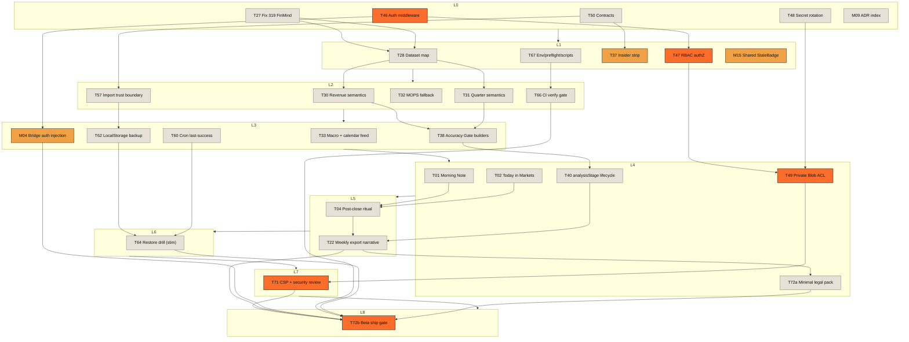

# 持倉看板 Task 2 TODO 與執行順序

更新時間：`2026-04-18 14:02 CST`

## 1. 簡介

R108 已把產品階段鎖定成 **internal beta**：先交付能安全示範、可驗證 correctness、能做 restore、能完成 owner signoff 的最小線。本頁只放 execution ledger，因此把 `69` 條 active workstream 拆成 `Ship-Before 30 / Beta+1 20 / Backlog 19`，並保留 Phase 2 debt、9 層 DAG、T-ID mapping 與 critical path，方便直接排程與驗收。

## 2. 30 條 Ship-Before

### 2.1 Product

| ID  | Title                                                                   | Category | Est. h | Depends     | Blocks    | Risk | Ship-level  |
| --- | ----------------------------------------------------------------------- | -------- | ------ | ----------- | --------- | ---- | ----------- |
| T01 | Surface Morning Note on Dashboard with deep-links                       | Product  | 6      | —           | T04,T22   | Med  | ship-before |
| T02 | Build Dashboard `Today in Markets` module                               | Product  | 8      | T32,T33     | T04,T22   | Med  | ship-before |
| T04 | Add post-close ritual mode + tomorrow-action editorial card             | Product  | 8      | T01,T02,T40 | T22       | Med  | ship-before |
| T22 | Deliver weekly export narrative + insider section; true PDF/cover later | Product  | 12     | T04,T40,T49 | T72a,T72b | High | ship-before |

### 2.2 Eng

| ID  | Title                                                                     | Category | Est. h | Depends     | Blocks            | Risk | Ship-level  |
| --- | ------------------------------------------------------------------------- | -------- | ------ | ----------- | ----------------- | ---- | ----------- |
| T37 | Strip insider buy/sell language in analyze/brain/analyst-reports/research | Eng      | 6      | T50         | T22,T23,T38       | High | ship-before |
| T38 | Enforce Accuracy Gate in all prompt builders                              | Eng      | 8      | T30,T31,T37 | T16,T40           | High | ship-before |
| T40 | Roll out `analysisStage` t0/t1 lifecycle and auto-confirm logic           | Eng      | 6      | T30,T31,T50 | T04,T14,T22       | High | ship-before |
| T46 | Add shared API auth middleware, fail-closed defaults, remove open CORS    | Eng      | 6      | —           | T47,T49,M04,T71   | High | ship-before |
| T47 | Add server-side `requirePortfolio` / RBAC authZ                           | Eng      | 8      | T46         | T49,T60,T72a,T72b | High | ship-before |
| T49 | Regrade Blob ACLs: private brain/research/snapshot, telemetry exception   | Eng      | 8      | T46,T47,T48 | T22,T71,T72a,T72b | High | ship-before |
| T50 | Add canonical contracts in `src/lib/contracts` + parse boundaries         | Eng      | 8      | —           | T37,T40,M15,T57   | High | ship-before |
| T57 | Add backup import trust boundary (allowlist/schema/confirm)               | Eng      | 4      | T50         | T62,T64           | Med  | ship-before |
| T71 | Add CSP/security headers + XSS/prompt-injection review                    | Eng      | 8      | T46,T49     | T72a,T72b         | High | ship-before |
| M15 | Build shared `<StaleBadge>` component as the stale/freshness UI primitive | Eng      | 4      | T50         | T09,T16,T25       | Med  | ship-before |

### 2.3 Data

| ID  | Title                                                                  | Category | Est. h | Depends | Blocks                  | Risk | Ship-level  |
| --- | ---------------------------------------------------------------------- | -------- | ------ | ------- | ----------------------- | ---- | ----------- |
| T27 | Fix FinMind `319 call-method-error` availability gap                   | Data     | 10     | —       | T28,T30,T31             | High | ship-before |
| T28 | Build authoritative FinMind dataset map + method registry              | Data     | 8      | T27     | T30,T31,T32,T33,T34,T36 | High | ship-before |
| T30 | Correct monthly revenue announced-month semantics end-to-end           | Data     | 6      | T27,T28 | T38,T40,T45             | High | ship-before |
| T31 | Correct quarter/H1/H2 financial semantics and derived standalone logic | Data     | 8      | T27,T28 | T38,T40,T45             | High | ship-before |
| T32 | Harden MOPS revenue/announcement ingestion and fallback contract       | Data     | 6      | T28     | T02,T12,T33             | Med  | ship-before |
| T33 | Add macro / 央行 / calendar feed for `Today in Markets`                | Data     | 6      | T32     | T02,T05,T12             | Med  | ship-before |

### 2.4 Ops

| ID  | Title                                                                       | Category | Est. h | Depends | Blocks      | Risk | Ship-level  |
| --- | --------------------------------------------------------------------------- | -------- | ------ | ------- | ----------- | ---- | ----------- |
| T48 | Rotate secrets, add inventory, Secret Manager, and launch-script cleanup    | Ops      | 6      | —       | T49,T60,T67 | High | ship-before |
| T60 | Add cron last-success markers and lateness alerts                           | Ops      | 6      | T47,T48 | T64,T72b    | High | ship-before |
| T62 | Extend checkpoint/backup contract to include localStorage                   | Ops      | 8      | T57     | T64,T72b    | High | ship-before |
| T64 | Run restore drill, rollback test, and MDD recovery test                     | Ops      | 5      | T60,T62 | T72b        | High | ship-before |
| M04 | Add Agent Bridge dashboard auth injection so T46 does not cause silent 401s | Ops      | 3      | T46     | T72b        | High | ship-before |

### 2.5 Testing

| ID  | Title                                        | Category | Est. h | Depends | Blocks | Risk | Ship-level  |
| --- | -------------------------------------------- | -------- | ------ | ------- | ------ | ---- | ----------- |
| T66 | Add GitHub CI workflow + `verify:local` gate | Testing  | 4      | T67     | T72b   | Med  | ship-before |

### 2.6 Docs

| ID   | Title                                                                                                                   | Category | Est. h | Depends                 | Blocks        | Risk | Ship-level  |
| ---- | ----------------------------------------------------------------------------------------------------------------------- | -------- | ------ | ----------------------- | ------------- | ---- | ----------- |
| T67  | Expand `.env.example`, clean launch scripts/inventory, add preflight, remove stale refs                                 | Docs     | 6      | T48,M09                 | T66,T72a,T72b | Med  | ship-before |
| T72a | Finish internal-beta minimal legal/docs pack: disclaimer, privacy-lite, data residency, audit schema, release checklist | Docs     | 5      | T22,T46,T47,T49,T67,T71 | T72b          | Med  | ship-before |
| T72b | Finish beta ship gate: smoke, owner signoff, demo path, invite/feedback readiness                                       | Docs     | 4      | T64,T66,T72a,M04        | —             | High | ship-before |
| M09  | Promote the 2026-04-11 staged-daily consensus into ADR/index so onboarding sees the true runtime contract               | Docs     | 2      | —                       | T67,T72b      | Low  | ship-before |

## 3. 20 條 Beta+1

| ID  | Title                                                                                               | Category | Est. h | Depends         | Blocks          | Risk | Ship-level |
| --- | --------------------------------------------------------------------------------------------------- | -------- | ------ | --------------- | --------------- | ---- | ---------- |
| T03 | Upgrade Daily Principle card to contextual quote + copy/share                                       | Product  | 4      | —               | T04,T22         | Low  | beta+1     |
| T05 | Surface anxiety indicators X1-X5 across dashboard/holdings/detail                                   | Product  | 12     | T08,T30,T31,T33 | T16,T24         | High | beta+1     |
| T06 | Finish multi-portfolio switcher smoke + edge states                                                 | Product  | 4      | T55             | T07,T24         | Med  | beta+1     |
| T07 | Complete multi-level holdings filters                                                               | Product  | 8      | T06,T08         | T24,T26         | Med  | beta+1     |
| T08 | Rebuild holdings detail pane on canonical `HoldingDossier`                                          | Product  | 12     | T35,T50         | T05,T07,T17     | High | beta+1     |
| T09 | Rewrite stale/data-gap UX in holdings rows and summaries                                            | Product  | 6      | T08,T16,T34     | T17,T24         | Med  | beta+1     |
| T12 | Polish news filters, objective summaries, and source/time badges                                    | Product  | 6      | T32,T33,T36     | T24,T26         | Med  | beta+1     |
| T14 | Finish streaming close-analysis UX and fallback states                                              | Product  | 8      | T38,T40         | T15,T24         | High | beta+1     |
| T15 | Ship same-day fast/confirmed diff and rerun cues                                                    | Product  | 6      | T40             | T04,T14         | Med  | beta+1     |
| T16 | Apply Accuracy Gate UI to every AI surface                                                          | Product  | 10     | T38,T50,M15     | T09,T14,T17     | High | beta+1     |
| T19 | Finish trade stepper/preview/apply + compliance memo UX                                             | Product  | 8      | T21,T57,T71     | T24,T26         | High | beta+1     |
| T21 | Complete `OperatingContext` on Trade/Log routes                                                     | Product  | 3      | T53,T54,T55     | T19,T20,T26     | Med  | beta+1     |
| T23 | Establish insider persona/compliance copy system cross-route                                        | Product  | 8      | T37             | T19,T22,T24     | High | beta+1     |
| T34 | Refine target-price lineage, freshness, and source labels                                           | Data     | 8      | T28,T32         | T09,T17,T22,T36 | High | beta+1     |
| T35 | Expand supply-chain/theme/company-profile enrichment                                                | Data     | 8      | T28             | T08,T17,T18,T42 | Med  | beta+1     |
| T36 | Normalize Gemini grounding merge policy + citations                                                 | Data     | 6      | T28,T34,T35     | T12,T45         | Med  | beta+1     |
| T52 | Add FinMind governor, endpoint boundary, and lint guardrail                                         | Eng      | 8      | T27,T28         | T38,T70         | High | beta+1     |
| T53 | Write AppShell state-ownership ADR/current-target matrix                                            | Eng      | 4      | —               | T21,T54,T55,T58 | Med  | beta+1     |
| T54 | Split `useAppRuntime` / `useAppRuntimeComposer` into bounded slices + resolve half-dead store state | Eng      | 12     | T53             | T21,T25,T55,T68 | High | beta+1     |
| T55 | Contain `useRoutePortfolioRuntime` and codify `/trade` write exception                              | Eng      | 8      | T53,T54         | T06,T21,T68     | High | beta+1     |

## 4. 19 條 Backlog

這一組不是「可忽略」，而是 **待 ship-before 完成後再開** 的後續 active workstream。A1/A2/B13/A3/A4 的聚合 debt 另外見 §5。

| ID  | Title                                                                                     | Category | Est. h | Depends                         | Blocks           | Risk | Ship-level |
| --- | ----------------------------------------------------------------------------------------- | -------- | ------ | ------------------------------- | ---------------- | ---- | ---------- |
| T11 | Complete events editorial hero/review queue + thesis/pillar feedback loop                 | Product  | 8      | T08,T39                         | T26,T45          | High | backlog    |
| T17 | Finish research backlog/data-gap center + explicit `coachLessons` injection               | Product  | 10     | T08,T34,T35,T45                 | T18,T22,T26      | High | backlog    |
| T18 | Surface four-persona scoring and explanation in research                                  | Product  | 8      | T17,T42                         | T22              | Med  | backlog    |
| T20 | Finish log reflection stats/filter/export UX                                              | Product  | 8      | T21,T26                         | T24              | Med  | backlog    |
| T24 | Complete mobile IA and responsive behaviors across core 5 routes                          | Product  | 10     | T06,T07,T12,T14,T17,T19,T20,T25 | T69              | Med  | backlog    |
| T25 | Fill empty/loading/error/skeleton states across core 5 routes                             | Product  | 12     | T54,M15                         | T24,T69          | Med  | backlog    |
| T26 | Finish cross-page handoff contract in UI, incl. `News -> Events/Daily`                    | Product  | 6      | T01,T11,T21                     | T20,T22          | Med  | backlog    |
| T29 | Normalize institutional labels end-to-end + regression                                    | Data     | 3      | T27,T28                         | T33,T40          | Med  | backlog    |
| T39 | Harden brain audit merge lifecycle and buckets                                            | Eng      | 8      | T38,T50                         | T11,T40,T45      | High | backlog    |
| T42 | Integrate four-persona runtime scoring contract                                           | Eng      | 6      | T35,T45                         | T18              | Med  | backlog    |
| T45 | Correct 600-rule knowledge base/provenance + clean live thesis narratives (6862 included) | Content  | 12     | T30,T31,T36                     | T17,T18,T42      | High | backlog    |
| T51 | Add snapshot `schemaVersion` normalize-on-read/write                                      | Eng      | 2      | T50                             | T40,T63,T64      | Med  | backlog    |
| T58 | Define service catalog, 3 SLOs, and incident thresholds                                   | Ops      | 6      | T53                             | T59,T60,T61,T72b | High | backlog    |
| T59 | Add structured logging schema + telemetry taxonomy + alert sink                           | Ops      | 8      | T58                             | T60,T61,T72b     | High | backlog    |
| T61 | Instrument web RUM + API/cron APM                                                         | Ops      | 6      | T58,T59                         | T72b             | Med  | backlog    |
| T63 | Add dataset fingerprint/manifest + replay diff tools                                      | Ops      | 6      | T51,T52                         | T64              | High | backlog    |
| T68 | Expand coverage to pages/components/store direct tests + route-shell prod guard           | Testing  | 8      | T50,T54,T55,T66                 | T69,T70          | High | backlog    |
| T69 | Add Playwright E2E for 3 golden flows + responsive smoke; visual suite later              | Testing  | 10     | T24,T25,T66,T68                 | T72b             | Med  | backlog    |
| T70 | Add maxDuration / cron schedule / rate-limit recovery tests                               | Testing  | 6      | T52,T60,T66,T68                 | T72b             | High | backlog    |

## 5. Phase 2 Top Debt

以下五條不是從 active list 消失，而是 **待 ship-before 完成後再開** 的聚合 debt：

### 5.1 A1 — god-hook 全拆（`useAppRuntimeComposer` / route runtime）

這一條代表的是 `T53/T54/T55` 後面的完整 Phase 2 refactor，不是今天先把 runtime ownership ADR 寫出來就算結束。ship-before 只要求把 ownership、route write exception、最低限度 slice boundary 講清；**真正 2183 LOC 級別的 runtime 拆解要等 ship-before 清完後再開**。

### 5.2 A2 — CSP 完整版 + 剩餘 security headers

ship-before 會先靠 `T71` 補最低限度 header 與 XSS / prompt-injection review，但完整 CSP、Referrer-Policy、Permissions-Policy 與 asset allowlist 不應混進本輪 beta gate。**Phase 2 再把 minimal hardening 升成 long-term policy**。

### 5.3 B13 — perf budget + bundle splitting

這不是「可有可無」，而是故意晚一拍。現在最先決的是 truthfulness、restore、auth、artifact ACL；等 ship-before 的 correctness boundary 站穩後，再把 bundle budget、manualChunks、route-level loading performance 收編成正式 perf contract。

### 5.4 A3 — route shell containment + `/trade` 例外治理

本輪文件已把 `/trade` 寫成明文 write 例外，但 **更深一層的 route-shell containment** 仍是 Phase 2 debt。ship-before 先做到「不要再畫錯、不要再假裝 route shell 是真 runtime」，Phase 2 才把 canonical runtime / migration shell 徹底分離。

### 5.5 A4 — backup import trust boundary 完整版

`T57` 先補 allowlist/schema/confirm 的最低邊界，但完整的 source signature、artifact provenance、回滾稽核與 replay diff，仍要等 `T63` 與 A1/A2 後續收口。ship-before 只求「匯入別再是任意 JSON 覆寫」；Phase 2 再把它變成真正的 restore platform。

## 6. 9 層 Mermaid DAG 執行順序

**DAG 判讀**

1. `T37` 已從 `T46/T47` 解鎖，只依賴 `T50`，因此可在 L1 與 auth/RBAC 平行開工。
2. `T46` authoritative 依賴是 `—`；`T48 → T46` 的舊偽 cycle 已移除。
3. `T72` 已拆成 `T72a`（最小 legal/docs pack）與 `T72b`（真正 ship gate）；`T73/T74/T75` 已內含於 `T72b`。
4. 最長 critical path 仍是 `T46 → T47 → T49 → T71 → T72b`。
5. 第二條長路徑是 `T27 → T28 → T30/T31 → T38 → T40 → T22 → T72b`，因此 data semantics 不是「可晚點補的 polish」。

## 7. T-ID 對應表

| T-ID | M-ID | R-name                                              | 新分類  | Ship-level  |
| ---- | ---- | --------------------------------------------------- | ------- | ----------- |
| T01  | —    | Morning Note on Dashboard                           | Product | ship-before |
| T02  | —    | Today in Markets module                             | Product | ship-before |
| T03  | —    | Daily Principle contextual card                     | Product | beta+1      |
| T04  | —    | Post-close ritual + tomorrow action                 | Product | ship-before |
| T05  | —    | X1-X5 anxiety indicators                            | Product | beta+1      |
| T06  | —    | Multi-portfolio switcher polish                     | Product | beta+1      |
| T07  | —    | Multi-level holdings filters                        | Product | beta+1      |
| T08  | —    | Canonical holdings detail pane                      | Product | beta+1      |
| T09  | —    | Stale/data-gap UX                                   | Product | beta+1      |
| T11  | —    | Events review loop (merged T10)                     | Product | backlog     |
| T12  | —    | News filters + objective summaries                  | Product | beta+1      |
| T14  | —    | Streaming close-analysis UX                         | Product | beta+1      |
| T15  | —    | Same-day diff + rerun cues                          | Product | beta+1      |
| T16  | —    | Accuracy Gate UI rollout                            | Product | beta+1      |
| T17  | —    | Research backlog center (merged T41)                | Product | backlog     |
| T18  | —    | Four-persona scoring surface                        | Product | backlog     |
| T19  | —    | Trade stepper / preview / apply UX                  | Product | beta+1      |
| T20  | —    | Log reflection stats / export UX                    | Product | backlog     |
| T21  | —    | `OperatingContext` on Trade/Log                     | Product | beta+1      |
| T22  | —    | Weekly export narrative + insider section           | Product | ship-before |
| T23  | —    | Insider cross-route copy system                     | Product | beta+1      |
| T24  | —    | Core-5 route mobile IA                              | Product | backlog     |
| T25  | —    | Core-5 empty/loading/error states                   | Product | backlog     |
| T26  | —    | Cross-page handoff contract (merged T13)            | Product | backlog     |
| T27  | —    | FinMind 319 availability fix                        | Data    | ship-before |
| T28  | —    | FinMind dataset registry                            | Data    | ship-before |
| T29  | —    | Institutional label normalization                   | Data    | backlog     |
| T30  | —    | Monthly revenue semantics                           | Data    | ship-before |
| T31  | —    | Quarter / H1 / H2 semantics                         | Data    | ship-before |
| T32  | —    | MOPS ingestion + fallback                           | Data    | ship-before |
| T33  | —    | Macro / 央行 / calendar feed                        | Data    | ship-before |
| T34  | —    | Target-price lineage + freshness                    | Data    | beta+1      |
| T35  | —    | Supply-chain / theme / profile enrichment           | Data    | beta+1      |
| T36  | —    | Gemini grounding merge policy                       | Data    | beta+1      |
| T37  | —    | Insider prompt strip                                | Eng     | ship-before |
| T38  | —    | Accuracy Gate in prompt builders                    | Eng     | ship-before |
| T39  | —    | Brain audit merge lifecycle                         | Eng     | backlog     |
| T40  | —    | `analysisStage` lifecycle                           | Eng     | ship-before |
| T42  | —    | Four-persona runtime scoring                        | Eng     | backlog     |
| T45  | —    | KB provenance + live thesis cleanup                 | Content | backlog     |
| T46  | —    | Shared API auth middleware                          | Eng     | ship-before |
| T47  | —    | Server-side RBAC authZ                              | Eng     | ship-before |
| T48  | —    | Secret rotation + Secret Manager                    | Ops     | ship-before |
| T49  | —    | Private Blob ACL + signed URL                       | Eng     | ship-before |
| T50  | —    | Canonical contracts                                 | Eng     | ship-before |
| T51  | —    | Snapshot `schemaVersion`                            | Eng     | backlog     |
| T52  | —    | FinMind governor + lint guardrail                   | Eng     | beta+1      |
| T53  | —    | AppShell state-ownership ADR                        | Eng     | beta+1      |
| T54  | —    | Runtime slice split (merged T56)                    | Eng     | beta+1      |
| T55  | —    | Route runtime containment + `/trade` exception      | Eng     | beta+1      |
| T57  | —    | Backup import trust boundary                        | Eng     | ship-before |
| T58  | —    | Service catalog + SLOs                              | Ops     | backlog     |
| T59  | —    | Structured logging + alert sink                     | Ops     | backlog     |
| T61  | —    | RUM + API/cron APM                                  | Ops     | backlog     |
| T62  | —    | Checkpoint includes localStorage                    | Ops     | ship-before |
| T63  | —    | Dataset manifest + replay diff                      | Ops     | backlog     |
| T64  | —    | Restore drill + rollback + MDD recovery             | Ops     | ship-before |
| T66  | —    | CI + `verify:local` gate                            | Testing | ship-before |
| T67  | —    | `.env.example` + launch hygiene bundle (merged T65) | Docs    | ship-before |
| T68  | —    | Page/component/store direct tests                   | Testing | backlog     |
| T69  | —    | 3 golden flows + responsive smoke                   | Testing | backlog     |
| T70  | —    | Cron / rate-limit / recovery tests                  | Testing | backlog     |
| T71  | —    | CSP + security headers + injection review           | Eng     | ship-before |
| T72a | —    | Internal-beta minimal legal/docs pack               | Docs    | ship-before |
| T72b | —    | Beta ship gate (folds old T73/T74/T75)              | Docs    | ship-before |
| —    | M04  | Agent Bridge dashboard auth injection               | Ops     | ship-before |
| —    | M09  | 2026-04-11 staged-daily ADR index                   | Docs    | ship-before |
| —    | M15  | Shared `<StaleBadge>` primitive                     | Eng     | ship-before |

## 8. critical path

1. Security / release path：`T46 → T47 → T49 → T71 → T72b`
2. Data semantics / content path：`T27 → T28 → T30/T31 → T38 → T40 → T22 → T72b`
3. `T72b` 是真正 ship gate，因此前面兩條鏈任一未完成，internal beta 都不能算 ready。
4. `T37`、`M04`、`T64`、`T66` 雖不在最長鏈上，但都是 release gate feeder；排程時不能把它們當成可無限後延的 side quest。
